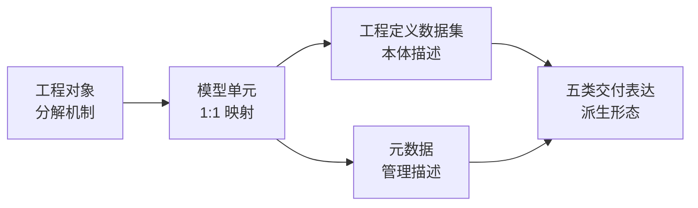
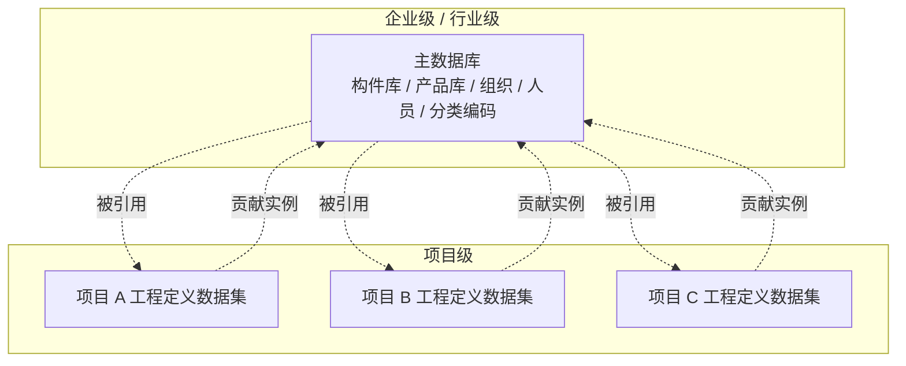
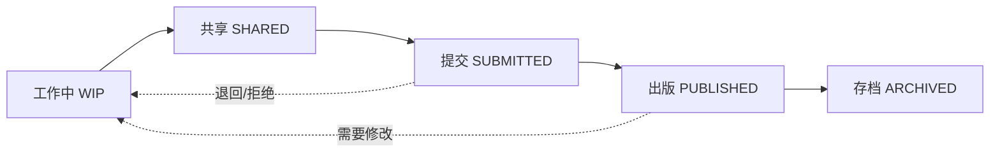
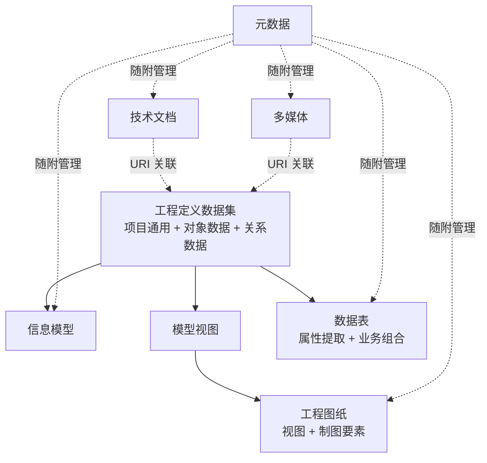

# 第三章：信息组织 (Information Organization)

> **本章导读**
>
> 建筑信息模型应用的成败，往往不在于建模软件的操作熟练度，模型创建的精细程度，而在于底层信息组织（Information Organization）的健壮性。如果把 BIM 看作一座数字大厦，那么几何模型只是其光鲜的外表，而信息组织则是支撑这座大厦不倒的骨架。
>
> 在工程数字化交付的深水区，行业面临着一个严峻的悖论：**数据体量的指数级增长与数据可用性的停滞不前**。我们拥有了 TB 级（1024G）的模型文件，却依然难以准确回答"这个项目有多少扇甲级防火门？"这样简单的问题。这种"数据丰富而信息贫乏"（Data Rich, Information Poor, DRIP）的现象，根源在于缺乏严谨、统一且机器可读的信息组织方法。
>
> 本章在新修订的《建筑信息模型交付标准》GB/T 51301 所建立的技术架构基础上展开，并参考 ISO 19650、ISO 23387、ISO 12006-3、ISO 7817-1 等国际标准与 buildingSMART 的 IFC 数据架构，把整个 BIM 信息组织体系组织为**两层架构**：项目级以五维骨架构成（**工程对象**作为信息挂靠的基本单元，**模型单元**作为工程对象的一一对应数字映射，**工程定义数据集**承载工程对象的本体描述，**元数据**与之并列承载管理性描述，**五类交付表达**（信息模型、工程图纸、数据表、技术文档、多媒体）作为最终的交付形态由数据集派生而来并由元数据加以管理）；企业级与行业级则以**主数据与主数据管理**为载体，把多个项目的信息组织积累为可共享、可比较的数字资产。这一两层架构既是本章的组织骨架，也是工程一线人员理解和实施 BIM 交付的核心方法论。

## 3.1 信息组织总论

### 3.1.1 工程数据的无序化倾向

任何一位经历过大型工程项目的技术人员，都会对项目后期那种"找不到文件、对不上版本、说不清口径"的混乱状态深有体会。这种混乱并非某个人的疏忽，而是工程信息系统在缺乏结构化约束条件下的必然归宿，参与的人越多、持续的时间越长、产生的文件越多，混乱就越严重。

道理并不复杂。一个典型的大型建设项目，其参与方往往包括业主、多家设计院（建筑、结构、机电、幕墙、景观等）、总承包商、数十家专业分包商、材料供应商、监理单位以及政府监管部门，参与者可达数千甚至上万人，项目周期横跨数年。在这样一个庞大而松散的协作网络中，每一个参与方都在持续不断地产生信息：设计图纸、计算书、变更通知、会议纪要、施工方案、质量验收记录、采购订单、现场照片……这些信息的总量随项目推进呈指数级增长，但有序程度却在同步衰减。之所以如此，根本原因在于这些信息从一开始就缺乏统一的组织规则。在传统的工程实践中，甚至在许多号称采用了 BIM 技术的项目中，可信信息的存在形态主要是非结构化的：PDF 格式的图纸、Word 格式的变更单、JPG 格式的现场照片、Excel 格式的材料清单，遑论大量存在于工程师脑海中的隐性经验和散落于聊天记录中的临时约定。这些信息之间缺乏机器可识别的语义关联，版本控制也缺乏统一约定（如"最终版""最终版2""真的最终版"），跨专业的数据一致性更是只能通过人工比对来保障。

更棘手的是，数据混乱具有自我强化的特征，即一旦更新跟不上，就会陷入"一步跟不上，步步跟不上"的恶性循环。工程项目中有大量数据的采集窗口稍纵即逝：隐蔽工程封闭之前的施工照片、混凝土浇筑时的坍落度实测值、管线穿墙节点的实际坐标，这些信息如果没有在施工现场第一时间记录并同步到模型中，事后补录的成本往往是原始采集的数倍甚至数十倍，有时甚至需要破坏性拆检才能还原真实状态。而当某一批数据缺失之后，与之关联的下游数据也随之失去了校验基准：竣工模型无法与实际施工对照，运维系统的初始台账便建立在不可靠的基础之上。由此可见，数据更新的及时性与数据的可信性（Data Trustworthiness）直接挂钩。随着项目推进，专业条线不断增多，数据之间的交叉引用和依赖关系日趋复杂，维持同步更新的难度呈非线性增长。如果在项目早期就没有建立起强制性的数据采集与更新机制，到了后期再想"补课"，面对的将不是一两个文件的修订，而是一整张盘根错节的数据网络的全面梳理，这往往意味着推倒重来，或无以为继。

这种"不治则乱"在工程实践中有四类典型形态。第一类发生在行业层面，是更高层级的结构性缺位；后三类则在每一个具体项目内部反复显现，是这一结构性缺位在工程现场的直接投射。

第一类是框架割据。这是一个高于具体项目的结构性问题：信息组织框架本身缺乏跨项目的统一规则。当前国内大量 BIM 项目，各自约定项目级的分类、编码、属性集与模型拆分规则，每开一个新项目就要重新约定一遍。其影响有两层：在项目层面，参与各方需要在每个新项目上重新学习一套组织约定，迁移成本高、协同摩擦大；在行业层面，由于框架互不通用，数据无法在项目之间流转，更无法在更长周期内积累为可计算、可比较的行业资产，于是一个行业、地区或一家头部企业完成成百上千个 BIM 项目之后，依然无法回答"我们行业的某类机房、某类构件、某类系统的典型参数分布是什么"这样的基础问题。框架割据是 BIM 数据难以形成行业共享性的直接成因，也是中国 BIM 推进过程中亟待解决的顶层缺位。

第二类是语义断层。同一个物理对象，在不同阶段、不同专业的信息系统中往往拥有完全不同的名称和属性定义。建筑设计院交付的"防火门"，在施工单位的采购清单里可能被表述为"钢质乙级门"，在运维单位的资产管理系统中又变成了一个编号"FM-001"。尽管它们指向的是同一扇物理实体的门，计算机无法建立这三个名称之间的自动关联，这种关联完全依赖于人的记忆和经验。当一个项目涉及数万个这样的对象时，语义断层导致的信息检索失败和数据关联错误就变得不可避免。

第三类是数据冲突。同一工程对象的同一属性，在不同模型、不同文件、不同系统之间常常给出不一致甚至相互矛盾的取值。最常见的形式是版本错位：结构专业在第15版模型中将某根梁的截面高度从600mm调整为800mm，但建筑专业和机电专业使用的底图仍然基于第12版结构模型，由此引发的空间碰撞和设计矛盾，往往要到施工现场才被发现，而此时修改的代价已经是设计阶段的数十倍。版本错位只是其中最直观的一种：模型属性与图纸标注不一致、设计模型与施工实际不符、同一构件在不同业务系统中的编码或属性取值不同步、变更未在所有引用方中传导，本质上都属于数据冲突。其共同特征是项目同时存在多份相互矛盾的"事实"，下游决策因此失去可信的基准。

第四类是数据沉没。大量具有长期价值的数据，隐蔽工程的验收照片、关键节点的施工工艺参数、设备的出厂检测报告，被封存在纸质表格或孤立的电子文件中，随着工程竣工而进入档案馆。运维阶段需要这些数据来定位管线走向、了解原始结构状态、制定维保策略，却因为缺乏结构化的组织方式而无从检索。数据虽然存在，对后续使用者而言几乎等同于不存在。这一类问题在中国的工程实践中尤其突出，由于竣工资料长期以纸质归档为主，大量建筑在进入运维阶段后实际上处于"数字失忆"状态，物业管理者对建筑内部管线、设备参数和隐蔽构造的了解，往往不如当年的施工班组长。

面对数据自发趋向无序的现实，BIM 信息组织的核心使命就是建立一套持续生效的"数字秩序"（Digital Order）。具体而言，就是通过强制性的层级分解、语义分类、数据定义和关系建模，让每一条数据从诞生之日起不但有明确的身份、清晰的语义、规范的定义，更具备完备的体系归属特性，从而对抗信息的自发混乱倾向。这不是一次性地整理文件或规范命名，而是要建立一套贯穿项目全生命周期的结构化机制，一套对物理世界进行数字化映射的本体论（Ontology）框架。正是这套框架，构成了本章所要详细阐述的"信息组织"的核心内容。

### 3.1.2 从"文件交付"到"数据交付"的范式跃迁

这个问题触及了建筑信息化最深层的范式分野。在第二章中，我们已经从宏观视角论述了 BIM 所引发的三重范式转变，数据范式、行为范式与产业范式，并在产业范式（2.1.4 节）中明确指出：传统协作基础是"文档的交换"，而产业范式转变的核心正是从"文档交付"转向"数据集成"。本节将把这一宏观判断落到信息组织的具体技术层面，解释这种转变究竟意味着什么。

在传统的工程交付模式中，信息的载体是图纸和文档，预设的阅读者是人。一位经验丰富的工程师看到施工图平面图上的一个矩形、旁边标注的"C30"以及图例中对应的填充图案，会自动将这些视觉符号综合起来，理解为"这是一根采用 C30 混凝土的柱子"。这个认知过程对人类而言是直觉性的，但对计算机而言不可能完成，在计算机"眼中"，那不过是一组线条和字符的像素组合，不携带任何结构化的语义信息。第二章（2.1.1 节）将这种模式称为"经验驱动"范式：人类专家是唯一的"中央处理器"，核心信息载体是工程图纸和文档，认知负荷巨大且高度依赖个人经验。而这种以人为唯一解码器的模式，其局限性随着项目规模的增长而急剧放大。一个大型医院项目的施工图可能有数千张，造价工程师要从中统计所有防火门的数量和规格，需要逐张翻阅、手工记录。即便使用了 CAD 软件辅助标注，标注本身仍然是附着在图形上的文字注释，而非可被算法自动提取和运算的结构化字段。

数据交付（Data-Centric Delivery）范式的核心转变，在于将交付物从"给人看的文件"重新定义为"给机器读的数据"。

这一转变的技术含义是深远的。在数据交付范式下，BIM 模型的本质不再是一组三维图形，而是一个面向对象的数据模型，用第二章数据范式（2.1.2 节）的术语来说，是"概念、逻辑、物理三层数据模型"中逻辑层的具体实例化。前述那根柱子不再是平面图上的一个矩形，而是一个拥有唯一标识符（GlobalId）的数据对象，它携带着明确定义的属性字段：材质（Material = Concrete_C30）、截面尺寸（Width = 600, Depth = 600）、是否承重（LoadBearing = True）、耐火等级（FireRating = 2.00h）等。每一个属性都有严格的数据类型约束，字符串、整数、实数、布尔值或枚举值，每一个取值都有明确的计量单位和值域范围。在 IFC 标准中，这根柱子对应于 IfcColumn 类的一个实例，其属性通过 Pset_ColumnCommon 等标准属性集来组织，其材质通过 IfcMaterial 关联对象来描述。这种高度结构化的表达，使得同一个物理对象在全球任何一款符合 IFC 标准的软件中都能被无歧义地解析。

这种结构化所带来的能力跃迁体现在多个维度：算法可以在毫秒级别内遍历整个模型，自动找出所有满足特定条件的对象；基于规则引擎，计算机可以自动判断每根柱子的耐火等级是否满足《建筑设计防火规范》GB 50016 对该防火分区的要求；由于所有图纸本质上都是对同一套底层数据的不同投影，平面图、剖面图、工程量清单、三维视图可以从同一数据源自动生成，数据源唯一，视图天然联动。更深远的影响在于，当数据以结构化形式存在时，它就具备了跨系统流动的可能性，正如第二章数据范式（2.1.2 节）所论述的建筑信息"液态化"（Liquidity）概念：数据可以从一个软件平台无损地流向另一个平台，并能根据新平台的需要重塑其表达形态，但语义信息始终不变。

GB/T 51301 在信息组织一般规定中对此做了明确定位，要求工程信息应按结构化信息和非结构化信息两种方式组织：结构化信息以数据项为基本单位，非结构化信息以电子文件为基本单位。这段条文的深层含义在于，标准并未要求彻底废弃图纸和文档，这在当前工程实践中既不现实也不必要。其所确立的，是一个明确的优先级秩序：以模型单元（结构化信息）为核心，以图纸和文档（非结构化信息）为补充。

### 3.1.3 信息组织的五维架构与本章主线

那么，从混乱无序的原始数据状态，到结构严谨、语义清晰、可供机器推理的有序数据状态，中间需要建立怎样的组织结构？

GB/T 51301 给出了一个完整的回答：把整个 BIM 信息组织体系组织为五个一级维度构成的递进式骨架。从工程对象出发，经由模型单元的一一对应映射，落实为工程定义数据集所承载的本体描述；与数据集并列的是元数据，承载管理性描述；最终通过五类交付表达送交到接收方手中。

这五个维度的核心要点见下表：

| 维度 | 核心问题 | 关键机制 | 在本章 |
| ------ | ---------- | ---------- | ------ |
| **工程对象** Engineering Object | 信息要挂靠到哪个工程对象？ | 实体 / 逻辑分类、工程本体 / 施工资源划分、功能 / 空间分解 | 3.2 节 |
| **模型单元** Model Unit | 工程对象在模型中以什么形式存在？ | 项目级 / 功能级 / 构件级 / 零件级四级嵌套、模型单元与工程对象 1:1 对应 | 3.3 节 |
| **工程定义数据集** Engineering Definition Dataset | 工程对象有什么内在描述？ | 项目通用数据 + 工程对象数据（身份标识 / 几何呈现形式 / 属性数据）+ 工程关系数据 | 3.4 节 |
| **元数据** Metadata | 数据如何被识别、流转、追溯？ | 数据管理 / 流程管理 / 组织管理三类元数据；CDE 中工作中 → 共享 → 提交 → 出版 → 存档五态流转 | 3.5 节 |
| **交付表达** Delivery Expression | 数据以什么形态交付？ | 信息模型 / 工程图纸 / 数据表 / 技术文档 / 多媒体五类交付形式，前三类为主、后两类为辅 | 3.6 节 |

五个维度之间是单向递进、不可跳跃的依赖链条：

工程对象是整个体系的语义起点，所有信息都要挂靠到具体的工程对象上。脱离了工程对象，后续的所有数据组织都失去了归属点。模型单元是工程对象的数字化映射，二者一一对应。这一对应关系是 GB/T 51301 第 4.4.3 条最具结构性的规定：模型不是按软件文件拆、不是按专业拆、不是按图纸拆，而是按工程对象拆，从而把"模型怎么拆"这个长期争论不休的问题彻底锚定到工程的客观结构上。

在模型单元之上，工程信息从两个并列的角度被描述。一个是**工程定义数据集**，作为以交付为目标建立的"本体描述总集"，把每一个工程对象的身份、几何、属性、关系完整、稳定地刻画出来；它由三大块构成，分别是项目通用数据（项目级的全局基准信息）、工程对象数据（每一个工程对象的身份标识、几何呈现形式、属性数据）以及工程关系数据（工程对象之间的空间、组成、连接、控制四类关系）。另一个是**元数据**，作为对数据集本身及其内部数据项、电子文件的"管理描述"，回答"由谁、何时、何种状态、可被谁用、如何流转"等管理性问题。GB/T 51301 第 3.0.3 条明确两者并列形成于信息组织过程之中：工程定义数据集解决"工程对象的本体内容是什么"，元数据解决"这些内容的管理特征是什么"。

最终，五类交付表达（信息模型、工程图纸、数据表、技术文档、多媒体）是工程定义数据集与元数据共同送交到接收方手中的物理形态。其中信息模型、工程图纸、数据表为主要形式，从工程定义数据集中的模型单元属性数据直接派生；技术文档与多媒体为辅助形式，通过统一资源标识符（URI）与模型单元建立关联。所有五类交付表达在交付时都要附带元数据，由元数据加以标识、状态控制和追溯。

需要特别强调一点：上表的五个维度不是并列陈列的概念清单，而是一个**层层依赖的逻辑链条**。每一环都建立在前一环之上，前一环不清晰，后一环就失去依据。工程对象的分解结构若不清晰，模型单元的 1:1 映射就无从落实；模型单元若没有稳定的对应关系，工程定义数据集就失去归属对象；数据集与元数据若不分清，交付物就会出现"管理信息混入本体描述"的语义混乱；交付表达若不基于本体派生，就会产生模型与图纸不一致、文档与模型脱钩的版本问题。掌握这一依赖链条，就掌握了本章全部内容的内在秩序。

本章后续各节沿五维架构逐一展开：

- **3.2 节 工程对象**，确立信息组织的基本单元，阐述实体 / 逻辑分类、工程本体 / 施工资源划分、功能 / 空间分解机制；
- **3.3 节 模型架构**，建立模型单元与工程对象的 1:1 映射规则、四级嵌套体系与最小模型单元的战略选择；
- **3.4 节 工程定义数据集**，构造工程项目的数字化本体，覆盖项目通用数据、工程对象数据（身份 / 几何 / 属性）与工程关系数据；
- **3.5 节 元数据**，建立数据的管理与追溯机制，包括三类元数据划分、五态流转与命名规则；
- **3.6 节 从工程定义数据集到交付表达**，展示本体如何派生出五类交付形态，并衔接到第四章的信息交付流程；
- **3.7 节 主数据与主数据管理**，跳出单个项目，把信息组织扩展到企业级与行业级，把项目级数据集积累为可共享、可比较的数字资产。

### 3.1.4 项目级与企业级：信息组织的两个层级

3.1.3 节的五维架构是**面向单个项目**的信息组织骨架。从工程对象到交付表达，这五个维度回答的是"在一个具体项目中，BIM 信息应当如何被组织、描述、管理、送交"。这是 BIM 信息组织最核心、最直接、最先要解决的问题，也是本章 3.2 至 3.6 节的主体内容。

但 BIM 信息的工程价值不应只局限于一个项目。一家设计院完成上百个项目之后，这些项目的工程定义数据集累积起来本应形成可共享、可统计、可复用的"企业数字资产"；一个国家完成成千上万个项目之后，这些数据本应形成可比较、可汇总的"行业数字资产"。但在实践中，绝大多数企业、绝大多数行业，这些价值都没有被释放出来：每一个项目结束后，数据归档进档案库就再也无人问津；下一个项目开工时，所有规则、所有构件库、所有经验积累几乎要从零开始。

3.1.1 节所讨论的"框架割据"形态，正是这一问题在行业层级的集中体现。要从根本上解决它，仅靠项目级的五维架构是不够的，必须建立一个**更高层级的数据治理层**，让项目级的工程定义数据集能够跨项目积累、共享、复用，逐步形成企业级和行业级的数字资产。承担这一角色的，就是**主数据（Master Data）**及其配套的**主数据管理（MDM, Master Data Management）**。

主数据是指**在企业内（或行业内）跨多个业务系统、跨多个项目、跨较长时间维度共享使用的、相对稳定的核心业务数据**。在 BIM 语境中，标准化的构件库、产品库、组织主数据、人员主数据、分类编码主数据等，都属于主数据范畴。它与项目级工程定义数据集的核心差异在于：项目级数据集面向某一个具体项目，主数据库面向多个项目共享。

由此，整个 BIM 信息组织体系形成一个**两层架构**：项目级是操作层，企业级与行业级是资产层。

两层架构的运行机制是**双向流动**。主数据向项目级提供标准化引用源（"这台水泵的标准参数请用这一份"），项目级向主数据库回流新的使用实例（"这台水泵在 100 个项目中被引用"）持续积累为企业经验资产；当主数据本身发生更新（产品参数修订、组织变更）时，所有引用它的项目可以受控地获得同步。

这一两层架构对中国 BIM 行业的长期发展意义深远。**第一**，它是从"项目级 BIM"走向"企业级 BIM"的关键桥梁，只有当多个项目的数据能够汇聚为企业的主数据库，BIM 在企业层面才真正成为可累积的生产力。**第二**，它是消除框架割据、实现行业级数据共享的根本机制，如果建立行业级或地区级的主数据共享机制（如标准化构件主数据库），不同项目之间的数据就具备了天然的可比性和可汇总性，数据真正成为基础设施。

对全章内容定位的含义因此清晰：**3.2 至 3.6 节展开的是项目级的五维架构**，是 BIM 信息组织的操作层；**3.7 节展开的是企业级与行业级的主数据管理**。后者不是五维之外的"第六维度"，而是五维之上的资产层。读者在阅读后续各节时应当带有这一双层意识：项目级解决"做对"的问题，企业级解决"做强"的问题；项目级是当前国内 BIM 实践的主战场，企业级是 BIM 真正成为生产力的下一个十年的关键议题。

## 3.2 工程对象：信息组织的基本单元

3.1 节论证了一个核心命题：BIM 信息组织的根本任务，是建立一套贯穿项目全生命周期的"数字秩序"。但秩序必须建立在"基本单元"之上。这一节回答的就是这个最基础的问题：**整个 BIM 信息体系的最小语义起点是什么？**

答案是工程对象（Engineering Object）。新修订的《建筑信息模型交付标准》GB/T 51301 在 4.1 节将其定义为"建筑工程中构成工程本体或服务于工程建造的实体对象和逻辑对象的统称"。这一定义看似平实，实则确立了一个具有方法论意义的基本立场：BIM 信息不再以图纸、文件、专业为基本组织单位，而是以"工程世界中真实存在的对象"为基本组织单位。墙、柱、楼梯、防火分区、给排水系统、塔吊、施工脚手架，每一个工程对象都是一个独立的数据归属点，所有与之相关的几何描述、属性参数、关系链接，都要挂靠到这个对象上。

这种以工程对象为本的组织方式，与传统以图纸为中心的组织方式，构成了根本性的视角转换。传统模式下，一根柱子的信息散落于多个图纸文件中，平面图标注其位置、详图标注其配筋、计算书记录其荷载、采购清单记录其材料；要把这些信息聚合到这根柱子身上，需要工程师在头脑中完成跨文件的"信息缝合"。在工程对象为本的组织方式下，这根柱子作为一个独立的数据对象存在，所有与之相关的信息都直接挂载于它本身，工程师面对的是"对象 + 属性"的数据视图，而不是"文件 + 文字"的图纸视图。

工程对象不是一个抽象概念，而是一个具体的方法论锚点。本章后续所有章节，从模型单元（3.3 节）到工程定义数据集（3.4 节）、元数据（3.5 节）、交付表达（3.6 节），都建立在工程对象这一基础之上。脱离了工程对象，模型单元就失去了对应关系，数据集就失去了归属对象，关系网络就失去了节点。可以说，**工程对象的清晰定义与合理分解，是整套 BIM 信息组织体系成立的前提条件。**

### 3.2.1 工程对象的两类划分

GB/T 51301 从两个独立维度对工程对象进行了划分。第一个维度按"物质实在性"划分，区分工程实体对象与工程逻辑对象；第二个维度按"建设活动及其产出"划分，区分工程本体与施工资源。这两个维度互相正交，共同构成工程对象的分类骨架。

**实体对象与逻辑对象**

工程实体对象（Physical Engineering Object）描述的是具有确定建造材质与物理形态的工程组成部分。一根混凝土梁、一段钢结构柱、一台水泵、一扇防火门、一段 DN200 钢管，都是典型的实体对象。它们具有明确的物理边界，可以被设计、被加工、被运输、被安装、被巡检，最终成为或服务于物理建筑的一部分。

工程逻辑对象（Logical Engineering Object）则不表现为单一的物理实体，而是基于功能、空间、系统或管理层级所定义的工程组成部分。一栋建筑是由大量构件聚合而成的整体；电气系统是由多组用电设备、配电线路与控制装置在功能上相互关联形成的网络；防火分区是为满足消防安全要求划定的三维空间边界；某个分部工程是为施工质量管理而对工程内容作出的逻辑分组。这些对象在物理世界中并不存在一个"它本身"，但在工程语境中却是不可或缺的语义单元。

很多工程师初次接触这一区分时会产生疑问：既然逻辑对象在物理上不存在，为什么还要把它和实体对象放在同等地位？回答这个问题，需要回到工程实践的真实逻辑。建筑工程中大量的设计、计算、统计、管控活动，本质上都是围绕逻辑对象展开的。设计一座建筑的防火安全，并非按某根梁、某面墙逐一思考，而是按防火分区进行整体策划；管理一栋建筑的能耗，并非按单个灯具、单台空调统计，而是按用电系统或回路汇总；划分施工任务，并非按砖块、钢筋逐项分包，而是按分部分项工程组织。如果信息系统中只承认实体对象，这些围绕逻辑对象的工程活动就将失去信息载体，只能依赖人工的二次整理。

GB/T 51301 在条文说明中明确指出：工程实体对象与工程逻辑对象在信息组织中具有同等地位。这一条规定非常关键。它意味着，BIM 模型中既要建模那些"摸得到"的物理构件，也要建模那些"摸不到"的逻辑实体（空间、系统、分区、分组）后者同样应当拥有自己的标识、属性、关系记录，参与到与实体对象同等的数据流转中去。这与 ISO 23387:2025 中"对象（object）"的定义完全一致：可感知或可构想的世界的任何部分，涵盖设计对象、产品、工具设备、系统、空间、建筑等。在基于 ISO 12006-3 的数据字典体系中，这种对象对应于"主题（subject）"概念。

工程逻辑对象在 IFC 中有明确的实体类支撑。空间类逻辑对象对应 IfcSpace、IfcZone、IfcSpatialZone 等实体类；系统类逻辑对象对应 IfcSystem、IfcDistributionSystem 等实体类；分组类逻辑对象对应 IfcGroup 实体类。这些实体类与构件类（IfcWall、IfcColumn 等）在 IFC 中处于同一个抽象层级，都可以承载属性、参与关系，唯一的区别是它们的几何形态往往更为抽象，可能仅以一个空间体积或一组成员引用的形式存在。

**工程本体与施工资源**

第二个维度的划分，按建设活动及其产出来区分。GB/T 51301 将工程对象划分为工程本体与施工资源两大类别。

工程本体（Built Asset）指的是建设活动的最终产出，包括从单一构件到项目整体的全部层级。墙、柱、楼板属于构件级工程本体；给排水系统、暖通空调系统属于系统级工程本体；防火分区、机房属于空间级工程本体；建筑单体、子项目、整体项目属于项目级工程本体。这一概念与 ISO 19650 系列标准中的"建成资产（built asset）"内涵一致，是 BIM 交付要长期保留并最终交付给运维方使用的核心信息对象。

施工资源（Construction Resource）指的是建设活动过程中投入的生产要素，服务于工程本体的建造，自身不构成永久工程的组成部分。塔吊、施工电梯属于机械设备类施工资源；施工脚手架、临时围挡、混凝土泵车作业平台属于临时设施类施工资源；钢筋、混凝土、砂石、水泥属于施工材料类施工资源。这类对象在施工阶段需要被精细化管理，例如资源调配、安全监控、工期协调，但项目竣工后通常会被移除，不进入运维交付范围。

施工材料这一类比较特殊，具有阶段性的双重身份。在施工阶段，它作为待用物资被采购、运输、存储，此时是施工资源；一旦经过加工、安装成为永久工程的组成部分（钢筋绑扎入梁、混凝土浇筑成柱），其材质和性能信息就转化为相应工程本体构件的属性信息。这种身份转换在数据模型中需要妥善处理：施工阶段的资源台账与最终的构件属性集应当能够追溯关联，但不能简单合并为一份数据。

这两个维度的划分相互正交。一根 C30 混凝土柱是工程实体对象、工程本体；一个机电系统是工程逻辑对象、工程本体；一台塔吊是工程实体对象、施工资源；一段施工流水段是工程逻辑对象、施工资源。每一类都有其特定的信息组织需求和交付要求。

理解这两层划分的工程意义，关键在于把握**信息组织的"层级语义"**。当我们在 BIM 中谈论"墙体的耐火等级"时，我们指的是工程本体中的工程实体对象的属性；当我们谈论"防火分区的最大允许面积"时，我们指的是工程本体中的工程逻辑对象的属性；当我们谈论"塔吊的覆盖半径"时，我们指的是施工资源中的工程实体对象的属性。属性的语义、责任的归属、交付的范围，都受这两层划分的约束。模型组织上的混乱，往往源于对这两层划分的不自觉混淆。

### 3.2.2 工程对象的分解机制

确立了工程对象的分类，下一个核心问题是：在一个具体项目中，如何把整体的工程对象分解为可操作、可管理、可交付的层级化结构？这就是**工程对象分解机制**要回答的问题。

GB/T 51301 第 4.1.3 条规定了两种基本的分解方式：功能分解和空间分解，并允许两者并用。这一条文看似简单，背后却蕴含着对建筑工程组织逻辑的深刻理解。

**功能分解（Functional Decomposition）**

功能分解沿"系统组成"的逻辑展开。一个完整的工程项目可以按其内部子系统的功能层级，从顶层到底层逐级分解：项目 → 子项 → 系统 → 子系统 → 构件 → 产品 → 配件。这种分解的核心问题是："这些对象共同完成什么功能？"

以给排水系统为例，一个完整的项目级给排水系统可以分解为给水子系统、排水子系统、消防给水子系统、雨水子系统等若干子系统；给水子系统可以进一步分解为引入管、立管、横管、用水点等组成部分；每一个组成部分又可以分解到具体的管道、阀门、水泵、水表等构件；构件下还可以延伸到产品（特定型号的水泵）、配件（水泵的密封圈、紧固件）。整个分解链条沿"系统功能"的脉络展开，每一级对象都是上一级对象的功能组成部分，每一级又是下一级对象的功能集合体。

功能分解的特点是它强调"功能完整性"。分解过程中，子系统作为一个整体的功能边界不能被随意切断。一个集中供热系统的热源、热网、热用户三个组成部分必须作为一个整体被组织，否则整个系统的功能就无法被完整描述。同样，一个建筑给排水系统从市政接驳点到末端用水器具的整条管路必须作为一个整体被建模，否则水力计算、流量平衡、压力损失等系统级分析就无从开展。

**空间分解（Spatial Decomposition）**

空间分解沿"物理区域边界"展开。一个项目可以按其物理空间的层级，从大到小逐级分解：项目用地 → 子项 → 单体 → 楼层 → 防火分区 → 房间 → 设备区。这种分解的核心问题是："这些对象位于什么位置？"

以一栋医院建筑为例，建筑整体可以分解为地上塔楼、地下停车场、室外配套等子项；塔楼可以按楼层划分为地下层、首层、标准层、屋顶层；每个楼层可以按防火分区划分为若干个独立分区；每个防火分区内又可以按功能房间进一步划分为病房、走廊、护士站、检查室等。空间分解的层级结构对应建筑的空间组织逻辑，每一级空间对象都是上一级空间对象的物理子集，每一级又是下一级空间对象的物理容器。

空间分解的特点是它强调"位置归属性"。每一个具体的工程实体对象，无论它属于哪个功能系统，最终都要落位到某个具体的空间中。一根照明回路从配电箱出发，经过多个走廊、多个房间，最终到达若干灯具，这条回路上的每一段管线、每一个接线盒、每一盏灯具，都必须有其明确的空间归属。空间归属是后续质量验收、运维定位、巡检派单的基本依据。

**两种分解的并用与冲突处理**

在实际工程中，功能分解与空间分解几乎总是并用。同一根管道既属于给水系统（功能归属），又位于某个机电管井（空间归属）；同一台风机既属于送风系统（功能归属），又位于某个机房（空间归属）。两种分解视角共同存在，并不矛盾，因为它们回答的是不同的问题。

但当两种分解的边界出现冲突时，如何处理？GB/T 51301 给出了一条指导原则：**功能的独立性和完整性优先**。条文说明中举了一个典型例子：一个高层建筑中跨越多个楼层的竖向管井系统不宜按楼层切断，否则会破坏系统的连通性和控制逻辑。这一原则的内在逻辑是：空间是一种"切片"，功能是一种"流"。强行用空间切片去切断功能流，会破坏功能流的完整性，使系统级分析无法进行。

类似的判断在工程实践中比比皆是。机场建设项目通常按"飞行区+航站区"作空间一级分解；但航站区内的电气、给排水、暖通等机电系统并不按这一空间边界切断，而是依据各自系统的功能逻辑独立组织。再如，桥梁工程往往分为上部空间（梁、桥面、护栏）和下部空间（墩、台、基础）两部分；这种划分对结构构件的组织是合理的，但对于跨越上下部的供电系统、监测系统等，就不应跟随空间分解而切割。

正确的处理思路是：**先按空间作粗粒度的一级分解（如机场分为飞行区/航站区，桥梁分为上部/下部），再在每个空间区域内部按功能作系统组织**。这样既尊重了空间归属的工程意义，又不破坏系统功能的完整性。

**最小操作单元**

分解到什么深度才足够？这是工程实践中最常见的争论点之一。GB/T 51301 没有给出统一答案，因为这一深度本身是由项目的具体信息需求决定的。同一个空调机组，方案设计阶段只需要作为一个占位体存在，构件级即可；施工阶段需要拆解到风机、电机、滤网、控制器等独立部件以支持采购和安装，零件级才够；运维阶段如果需要追踪每一个滤网的更换周期，零件级仍是必需的。

这一原则在 3.3 节将被进一步形式化为模型单元的"最小模型单元"概念。这里只强调一点：分解深度不是越细越好，也不是越粗越好，而是要与项目所支持的业务用例精确匹配。过细则信息冗余、维护成本高；过粗则业务用例无法支撑、信息缺位。把握这一平衡，是工程对象分解机制成熟运用的标志。

### 3.2.3 分解机制为何是整套体系的基础

理解了工程对象的两类划分和两种分解，我们需要回到本节起始的判断：**工程对象的分解机制，是整套 BIM 信息组织体系的基础。**为什么这样说？

第一，**它是模型架构的依据**。GB/T 51301 第 4.4.3 条明确规定，信息模型的分解应以项目中对工程对象的层级划分和归属关系为依据，模型单元应与工程对象一一对应。这一条把"模型怎么拆"这个老大难问题彻底锚定到工程对象上：模型不是按软件文件拆，不是按专业拆，不是按图纸拆，而是按工程对象拆。工程对象怎么分解，模型单元就怎么对应；工程对象到了什么颗粒度，模型单元就要到什么颗粒度。这一对应关系是模型架构合理性的唯一判据，也是 3.3 节将要重点展开的内容。

第二，**它是数据集组织的根**。工程定义数据集（3.4 节）的三大组成部分（项目通用数据、工程对象数据、工程关系数据）中，工程对象数据的"对象"指的就是这里讨论的工程对象；工程关系数据所描述的"关系"，也是工程对象之间的关系。如果工程对象本身没有清晰的分解结构，工程对象数据将不知道挂在何处，工程关系数据也将不知道连接何方，整个数据集体系必然失去逻辑骨架。

第三，**它是关系网络的基础**。工程关系数据中的四类基本关系（空间关系、组成关系、连接关系、控制关系）中，前两类直接对应空间分解与功能分解的层级关系。一个构件"属于哪个空间"是空间分解链条上的归属关系；一个子系统"属于哪个上层系统"是功能分解链条上的归属关系。没有清晰的分解结构，这两类基本关系就无从建立。

第四，**它是责任与协同的边界**。工程对象的分解结构通常也是任务分解结构（WBS）的依据。每一级工程对象都对应着特定的责任主体：项目级对象由建设方或总包方负责，子项级对象由专业设计单位负责，构件级对象由施工分包方负责，产品级对象由制造商负责。分解清晰，责任就清晰；分解模糊，责任就模糊。GB/T 51301 第 8.0.1 条要求"信息生产前，应依据本标准关于工程对象分解结构的规定进行生产任务分解"，正是基于这一逻辑。

第五，**它是验收与移交的单位**。工程对象的分解结构最终也是验收与移交的组织框架。工程交付不可能"整体一次性验收"，必然要按层级、按系统、按区域逐项验收。分解结构提供了验收的天然边界：构件级对象逐件验收，系统级对象按系统功能验收，子项级对象按整体竣工验收，全部完成后达成项目级整体移交。工程对象的分解清晰，验收的标准、流程、责任就有了载体。

总结来说，**工程对象的分解机制不是一个孤立的技术规则，而是 BIM 信息组织体系的"主轴"**。模型架构挂在这条主轴上、数据集挂在这条主轴上、关系网络挂在这条主轴上、责任协同挂在这条主轴上、验收移交挂在这条主轴上。一旦这条主轴清晰且稳定，整个信息组织体系就具备了内在的逻辑一致性；反之，无论后续的元数据多么完备、属性集多么丰富、命名规则多么严密，如果工程对象的分解本身就是混乱的，所有这些上层努力最终都会失去支撑。

这也是为什么，在本指南所提出的新版第三章结构中，工程对象一节被前置到所有具体技术展开之前。它不是一个可选的引言，而是一个必不可少的逻辑起点。在掌握了工程对象与分解机制之后，我们才能进入下一节关于模型单元的讨论。

## 3.3 模型架构：模型单元与工程对象的 1:1 映射

3.2 节确立了工程对象作为信息组织的基本单元，并阐明了对象分解机制。本节回答下一个核心问题：**这些工程对象在 BIM 模型中以什么形式存在？**

新修订的 GB/T 51301 在 4.4 节给出了系统回答：BIM 模型由"模型单元"（Model Unit）组成；模型单元是工程对象的数字化映射；模型单元与工程对象一一对应。这三句话简洁朴素，却定义了整个 BIM 模型架构的基本秩序：模型单元是工程对象的"分身"，每一个模型单元背后都对应着一个具体的工程对象，模型的拆分方式必须服从工程对象的分解结构，而不能反过来。

为什么这一点如此关键？因为长期以来，工程实践中"模型怎么拆"始终是一个争议不断的问题。一种常见的做法是按软件文件拆，一个 Revit 项目文件就是一个模型；另一种是按专业拆，建筑模型、结构模型、机电模型各自独立；还有按图纸拆，施工图模型、深化模型、竣工模型；更有按楼层拆、按工序拆、按合同拆。每一种拆法似乎都有自己的理由，但当多个项目、多个参与方、多个阶段交织在一起时，这些不同拆法之间就难以对齐，**同一个工程对象在不同模型中可能根本无法被识别为"同一个"**。这正是 3.1.1 节所讨论的语义断层与数据冲突的根源之一。

GB/T 51301 引入"模型单元 ⇔ 工程对象"的 1:1 映射原则，本质上是把这一片混乱锚定到一个唯一的、可被验证的基准上：工程对象是物理世界中真实存在的、客观的对象，它的边界、它的层级、它的归属，都不是由软件、专业或合同人为决定的，而是由工程本身的功能与空间逻辑决定的。当模型单元被强制要求与工程对象 1:1 对应时，模型的拆分方式就被锚定到了工程的客观结构上，与软件、专业、合同的临时性约定脱钩。

### 3.3.1 模型单元的本质：工程对象的数字化映射

ISO 19650 系列标准为信息管理引入了"信息容器"（Information Container）的核心概念，把任何承载工程信息的载体（一个 IFC 文件、一份 PDF 图纸、一张 Excel 数据表）统称为信息容器。这个概念足够通用，但也因此过于"中性"：它并不强调载体中的信息是否具备三维空间表达能力，也不要求信息以面向对象的方式组织。一份 PDF 图纸和一个 IFC 模型文件，在 information container 的框架下并无结构性区别。

GB/T 51301 提出的"模型单元"概念，则精准地弥补了这一空缺。在标准 4.4.1 条的定义中，模型单元是"建筑信息模型中承载工程对象数据的基本组成单元，是工程对象的结构化数字表述"。两个关键短语值得品读：第一个是"承载工程对象数据"，明确了模型单元的内容核心是工程对象数据，而不是任意的图形、文字、文件；第二个是"工程对象的结构化数字表述"，明确了模型单元与工程对象之间的语义绑定关系，每一个模型单元都是某一个工程对象的数字化身。

这与 ISO 19650 的"信息容器"形成了清晰的层级递进。信息容器是一个通用的载体概念，回答"信息装在哪里"；模型单元则是一个具有特定语义结构的载体概念，回答"信息装在哪里 + 这些信息描述的是哪个工程对象"。模型单元继承了信息容器的全部容器属性（标识、状态、版本、流转），同时又额外承载了对象语义。

需要特别强调的是，模型单元**不等于一个 IFC 文件、不等于一个 Revit 族、不等于一段几何体**。它是一个抽象的对象单元，可以由几何信息（三维形体）、文字信息（属性数据）、关联引用（与其他模型单元的关系）共同构成。在 IFC 的实现层面，一个模型单元可能对应一个 IfcWall 实例、一个 IfcSpace 实例、一个 IfcSystem 实例，等等；这些实例可能聚合若干 IfcShapeRepresentation、IfcPropertySet、IfcRelationship 等子结构，但它们共同指向同一个工程对象，因此构成同一个模型单元。

模型单元的关键特征，是**自我嵌套机制**（Self-Nesting）。一栋建筑本身是一个模型单元，它包含若干楼层模型单元；每个楼层模型单元又包含若干空间和构件模型单元；构件模型单元还可以进一步包含零件级模型单元。这种从整体到局部、层层包含的递归结构，使得模型单元既不是"不可再分的原子"，也不是无差别的信息堆积，而是一套具有清晰层级关系的组织框架。这一层级结构与工程对象的分解结构完全对应，每一层模型单元都映射到一层工程对象，每一层工程对象都对应一层模型单元。

### 3.3.2 四级模型单元：项目级、功能级、构件级、零件级

GB/T 51301 第 4.4.2 条把模型单元划分为四个基本层级：项目级、功能级、构件级、零件级，各级均可嵌套设置。这一划分对应于 3.2.2 节所讨论的工程对象分解链条。

**项目级模型单元**承载项目或子项的全局环境与基础规则的通用信息。它对应工程对象分解链的最顶层，整个项目作为一个工程对象。项目级模型单元的内容主要是项目通用数据（详见 3.4.2 节）：项目坐标系统、轴网、标高体系、计量单位、参与方信息、建设阶段、技术经济指标等。这些信息不依附于任何具体的物理构件，而是作为整个模型的全局基准被维护。

**功能级模型单元**承载完整功能的模块或空间信息。它对应工程对象分解链的中间层，若干构件聚合而成的功能单元，如一个机房、一段标准化集成单元、一个防火分区、一个机电系统、一个交通核心筒。功能级模型单元的特点是它在物理上对应一组构件的集合，但在语义上是一个"功能整体"。运维阶段所关心的"机房 X 的能耗""防火分区 Y 的合规状态"等管理对象，往往就落在这一层。

**构件级模型单元**承载单一的构配件或产品信息。它对应工程对象分解链的基本操作层，即可独立识别与交付的物理构件，如一根梁、一根柱、一台水泵、一扇门、一段管道。构件级是建筑信息模型中最常见、最基本的操作对象。绝大多数 BIM 建模、碰撞检查、工程量统计、施工图生成的工作，都发生在这一层级。

**零件级模型单元**承载从属于构配件或产品的组成零件或安装零件信息。它对应工程对象分解链的微观层，构件的内部组成部分，如水泵的电机、滤网、密封圈，或门的门框、门扇、五金件、电子锁。零件级通常服务于深化设计、加工制造、运维资产管理等需要更细颗粒度的场景，并不在所有项目、所有阶段都需要。

这四级之间的关系是嵌套而非平行：项目级模型单元包含若干功能级模型单元，每个功能级模型单元包含若干构件级模型单元，构件级模型单元在需要时可进一步包含零件级模型单元。这种嵌套对应着工程对象分解的层级链条，使整个模型架构具有清晰、稳定、可计算的层级结构。

值得强调的是，**四级并非每个项目都必须用满**。一个简单的住宅项目，可能只用到项目级、构件级两层；一个复杂的工业建筑项目，可能在某些机电系统中用到全部四级；运维阶段的资产模型，可能只保留构件级和零件级而不需要功能级嵌套。具体用到哪几级、用到什么深度，由项目的信息需求决定，这正是 3.3.4 节"最小模型单元的战略选择"所要展开的话题。

### 3.3.3 1:1 对应原则：为什么模型必须按工程对象拆

GB/T 51301 第 4.4.3 条作出了整个标准中最具结构性意义的一条规定：

> 信息模型的分解应以项目中对工程对象的层级划分和归属关系为依据，模型单元应与工程对象一一对应。

这条规定看似简短，却把"模型怎么拆"这个长期争论不休的问题彻底锁死到了一个唯一的判据上：模型不是按软件文件拆、不是按专业拆、不是按图纸拆、不是按楼层拆、不是按合同拆，而是**按工程对象拆**。工程对象怎么分解，模型单元就怎么对应；工程对象到了什么颗粒度，模型单元就要到什么颗粒度；工程对象之间是什么归属关系，模型单元之间就建立同样的归属关系。

为什么 1:1 对应原则如此关键？

**第一，它是消除语义断层的根本机制。** 3.1.1 节讨论的语义断层问题，同一个物理对象在设计、施工、运维系统中拥有完全不同的名称，其根源正是模型单元与工程对象之间没有建立稳定的 1:1 映射。设计阶段建模时画的是"门"，施工阶段建模时画的是"采购的钢质乙级门组件"，运维阶段建模时画的是"资产编号 FM-001 的防火门"，这三个"模型对象"在不同系统中以不同的字段、不同的拆分方式存在，计算机无法自动识别它们指向的是同一扇物理门。1:1 对应原则要求所有阶段的模型单元都锚定到同一个工程对象，工程对象本身保持稳定的身份标识（详见 3.4.3 节），这就把跨阶段的对象识别从"靠人工记忆"变成了"靠数据自动追溯"。

**第二，它是支持差异化业务视图的前提。** 不同业务方对同一个工程对象有不同的视角，造价工程师看到的是"工程量子项 + 综合单价"，运维工程师看到的是"资产编码 + 维保周期"，结构工程师看到的是"截面尺寸 + 配筋"。如果每个业务方各建一份模型，最终结果是数据多源、口径不一、维护成本剧增。GB/T 51301 第 3.0.7 条引入"工程定义数据集"与"工程用例数据集"的区分（详见 3.4.1 节），明确把"对象本体"与"业务视图"分开：本体由工程定义数据集统一维护，业务视图由各方在本体之上按需重组。这一区分要成立，前提是本体本身必须稳定且唯一，而本体的稳定性正是由"模型单元 ⇔ 工程对象 1:1"原则保障的。脱离了 1:1 对应，本体本身就会分裂为多份，"一源多流"的架构便无法成立。

**第三，它是模型可计算、可校验、可审计的基础。** 当模型单元与工程对象 1:1 对应时，模型上的每一个对象都可以被算法独立识别、独立查询、独立校核。比如工程量统计的算法可以遍历所有 IfcColumn 实例，按其分类编码和材质属性自动汇总混凝土用量；规则引擎可以遍历所有 IfcDoor 实例，自动判断每一扇防火门的耐火等级是否满足其所在防火分区的要求；变更追溯系统可以遍历所有模型单元的版本历史，识别哪些工程对象在何时被谁修改。这些能力都要求模型单元具有清晰的对象边界和稳定的对象语义，而这两点都来自 1:1 对应原则。

**第四，它是责任划分与协同的边界基础。** 一个模型单元对应一个工程对象，意味着这个对象的所有信息（几何、属性、关系）都集中在同一个数据单元上，由同一个责任主体维护。建筑专业不能在自己的模型里偷偷修改一根结构柱的截面；机电专业不能擅自移动建筑专业的房间分隔。每一个模型单元有且只有一个"权威责任方"。这一原则让协同流程中的责任边界清晰、争议可追溯、变更可审计，这是 ISO 19650-2 所规定的 CDE（通用数据环境）受控协同流程能够运转的前提。

**第五，它是从设计到运维交付链路连续的关键。** 一个项目的工程对象在物理上是连续存在的：设计阶段画的那根柱子，施工阶段就是要浇筑的那根柱子，竣工后就是要运维的那根柱子。如果每一阶段的模型都是各自独立建立的、与前序阶段的模型在对象语义上断开，那么从设计到施工到运维的信息传递就只能依靠"重建模型"或"人工映射"，这正是行业中"竣工模型不可用"问题的根源之一。1:1 对应原则要求所有阶段的模型都基于同一套工程对象分解结构，模型单元的标识、层级、关系在跨阶段流转中保持稳定，这就为设计、施工、运维的信息连续性提供了底层保障。

需要特别澄清的一点是：1:1 对应**不**意味着模型必须建到极细的颗粒度，也**不**意味着所有工程对象在所有阶段都必须被建模。它的真正含义是："凡是被建模的工程对象，每一个对象在模型中只能对应一个模型单元；模型单元不能凭空存在、不能脱离工程对象、不能跨工程对象合并"。换言之，1:1 对应规定的是"映射关系的纯净性"，而不是"建模的覆盖范围"。后者由信息需求决定，是下一节"最小模型单元"要展开的话题。

### 3.3.4 最小模型单元的战略选择

3.3.3 节的 1:1 对应原则解决了"模型与工程对象之间的映射关系"问题。但它没有回答另一个同样关键的问题：**项目里的工程对象那么多，到底应当对哪些工程对象建立模型单元？**

GB/T 51301 没有给出统一答案。原因不难理解：建模的边界由项目的具体业务需求决定，而不同项目、不同阶段、不同业务的需求差异巨大。同一台空调机组，在方案设计阶段只需要表达为一个占位体；在施工图设计阶段需要表达为完整的机组对象；在深化设计阶段需要拆解到风机、电机、冷凝器、控制器等部件；在运维阶段如果业主需要追踪每一个滤网的更换周期，则甚至需要进一步拆到滤网级。建模深度不是越细越好，过细则信息冗余、维护成本高、模型臃肿；建模深度也不是越粗越好，过粗则业务用例无法支撑、关键信息缺失。

在这两端之间确定一个合理的边界，就是"最小模型单元"（Minimal Model Unit）的战略选择问题。所谓最小模型单元，是指在某个阶段、某个业务场景下，模型所需达到的最深层级。换言之，**项目中所有工程对象都至少要被建模到这一层级，但不要求都建到比这更深的层级**。

最小模型单元的边界，本质上由项目的业务用例决定。具体而言，**最小模型单元应当与"最小业务单元"（Minimum Operational Unit, MOU）相对应**，即与该业务活动需要独立识别、独立操作、独立记录的最小对象相对应。

> **例 3-1：门把手的三级跃迁。** 在方案设计阶段，甲方和建筑师讨论的是空间布局和功能流线，门只是平面图上的一个开口符号，门把手更不在考虑范围之内，此时最小模型单元是"门洞"。到了施工图阶段，门作为一个完整构件进入模型，参与工程量统计和碰撞检测，但门把手通常只是门族（Family）中嵌套的一段几何体，不具有独立的编码和属性，此时最小模型单元是"门"。而在高端酒店或智慧建筑的运维场景中，如果业主需要对每一把电子锁进行独立的资产管理，登记序列号、追踪保修期、派发换电池工单，那么门把手就必须从门族中"分离"出来，拥有自己的标识、资产编码和属性集，成为一个可被独立选中、独立查询、独立维护的对象。此时最小模型单元下探到了"门把手"。从门洞到门再到门把手，业务需求每深入一层，模型精度就必须对应地下沉一层。

行业实践中，最小模型单元的判断常有三种典型误区：

**误区一·一刀切**。BEP 中笼统地规定"所有专业一律建模至构件级"，既不区分区域的复杂度差异（机房与标准层不同），也不区分业务需求的差异（施工与运维不同）。结果是简单区域过度建模，复杂区域又精度不足。

**误区二·定义缺失**。BEP 中虽然规定了"建模到构件级"或"达到 LOD 3.0"，但对每一个层级下的最小模型单元没有给出具体的颗粒度说明：墙体需要建出每一层构造做法，还是只需一个整体厚度？门需不需要区分门框、门扇和五金件？当这些边界模糊时，不同的建模人员会给出不同的理解，模型质量参差不齐，后续应用时频繁出错。

**误区三·事后补救**。项目前期没有认真界定最小模型单元，到了施工或运维阶段才发现模型精度不够用，不得不大规模"补模"。此时设计信息已经冻结、现场条件已经改变，补建的模型既费时又难以保证与实际一致，往往沦为"形式上交差"。

避免这三种误区的关键，在于在项目早期就基于业务用例分析，对最小模型单元作差异化定义。一个成熟的做法是按"区域 × 阶段 × 用途"作三维交叉，分别确定最小模型单元：主要机房、设备夹层、复杂节点等业务密度高、运维管控严的区域，最小模型单元下探到零件级；标准层、走廊、办公空间等业务密度中等的区域，最小模型单元保持在构件级；室外景观、覆土区域等业务密度低、运维介入少的区域，最小模型单元可上提到功能级或仅作占位表达。

这种差异化的颗粒度策略，本质上是一种**资源配置的优化**：将有限的建模资源集中投放到业务价值最高的区域和阶段，在低价值区域适当"留白"。它既避免了过度建模带来的资源浪费，也确保了关键区域的信息充分性。对于项目管理者而言，理解并善用这一策略，是 BIM 在工程经济学维度上成功落地的关键杠杆。

### 3.3.5 模型精细度（LOD）的克制使用

工程实践中"模型精细度"（Level of Detail / Level of Development，简称 LOD）已经是一个被广泛使用的概念，国内外都有相应的等级体系。GB/T 51301 第 4.4.5 条对此作出了明确而克制的规定：模型精细度可用于评估信息模型的表述能力，**宜按最小模型单元的层级确定**。标准给出四级：

- **LOD 1.0**：包含项目级模型单元；
- **LOD 2.0**：包含功能级模型单元；
- **LOD 3.0**：包含构件级模型单元；
- **LOD 4.0**：包含零件级模型单元。

这一定义的关键意义在于，它把"模型精细度"这个长期模糊的概念明确锚定到了"最小模型单元的层级"这个客观标尺上。LOD 不是对建模视觉效果的主观判断，也不是几何细节多寡的简单度量，而是模型所达到的最深对象层级。

需要特别注意的是 GB/T 51301 在条文说明中表达的一种**克制立场**：标准明确指出，由于"模型精细度"概念缺乏统一且可量化的考核指标，**单纯使用"模型精细度"界定交付成果易因表述模糊引发履约争议**，因此不建议将其作为唯一的交付约束条件。这是一句非常重要的警示：在合同条款中，仅仅写"达到 LOD 3.0"远远不够，必须配合具体的"信息需求 + 数据模板 + 几何表达精度（Gx）+ 信息深度（Nx）"等多个维度共同界定。

标准还采取了一个谨慎的命名策略：将 LOD 的英文取义为"Level of Model Definition"，而**未直接引入特定机构的"Level of Development"体系及其细分层级（如 LOD 100–500）**，以避免不必要的版权风险和概念混淆。这一选择反映了标准编制者的清醒：在没有形成全球统一定义的前提下，强行使用某一机构的细分体系，反而会加剧行业内的口径不一致。

对工程实践者而言，这一节的实务启示是：**不要把 LOD 当成万能的尺子用**。LOD 是一个粗粒度的沟通概念，便于在项目早期与各方就建模范围达成大致共识；但它不能替代具体的最小模型单元定义、不能替代数据模板和属性清单、不能替代 Gx/Nx 等更精细的分级约束。把 LOD 与这些更具操作性的工具配合使用，才能既享受概念上的便利，又规避履约层面的争议。

## 3.4 工程定义数据集：工程项目的数字化本体

3.2 节确立了工程对象作为信息组织的基本单元，3.3 节建立了模型单元与工程对象的 1:1 映射规则。本节进入信息组织主线的第三个维度：**模型单元里到底装什么？**这个问题的答案，就是工程定义数据集。

GB/T 51301 在基本规定中把工程定义数据集定位为建筑信息模型交付的数据基础，并在工程定义数据集相关章节中规定其组成：项目通用数据、工程对象数据、工程关系数据三大块。这三块加在一起，就是一套工程项目作为"数字化本体"的完整描述。

工程定义数据集的本质，是把整个项目从抽象的"工程概念"翻译为机器可读、可计算、可复用的"数据本体"。它不是一份图纸或一个模型文件，而是一整套结构化的对象定义、属性定义、关系定义的集合。当这套集合达到一定的完备度和准确度时，整个工程项目就具备了脱离图纸、独立于软件、跨阶段稳定流转的数字化身份。这是 BIM 交付从"形似"走向"神似"的根本标志。

需要特别强调一点：工程定义数据集是一个**总集**概念。它不是某一节、某一类数据的局部定义，而是覆盖整个项目所有工程对象的全部本体描述。在一个具体项目中，工程定义数据集的内容会随着项目阶段的推进逐步丰富、逐步细化、逐步完备，但其根本结构（三大块组成、各自的内部子结构）是稳定的。这种稳定性是 BIM 信息能够跨阶段、跨参与方、跨系统流转的前提。

### 3.4.1 工程定义数据集与工程用例数据集

GB/T 51301 在基本规定中引入了一对关键的概念区分：**工程定义数据集**（Engineering Definition Dataset）与**工程用例数据集**（Engineering Use Case Dataset）。这一对区分，是新标准在数据架构层面最具理论意义的设计之一。

**工程定义数据集**回答的问题是："工程对象本来是什么样？"它对工程项目中每一个工程对象，作出统一、稳定、与具体业务场景无关的本体描述。一根 C30 混凝土柱的几何尺寸、材料牌号、空间位置、所属系统，这些信息无论是用于造价、用于碰撞检测、用于运维巡检，都不会因业务用途的变化而改变。它们是这根柱子作为工程对象的"客观事实"，一旦正确确立，就可以被项目中所有业务方共享。

**工程用例数据集**则回答的是另一个问题："针对某一项具体业务，工程对象需要被组织成什么样？"造价工程师要做工程量计算，需要把柱子的混凝土与钢筋拆开、按工程量清单子项重新归类、挂接定额编码与综合单价；运维工程师要做资产管理，需要把柱子按资产编码组织、绑定维保周期与责任主体；施工工程师要做进度管理，需要把柱子按施工流水段归集、关联工序与里程碑。每一个业务场景都对应一份工程用例数据集，每一份用例数据集都基于工程定义数据集重新组织。

GB/T 51301 对两者的关系作出了明确规定：工程定义数据集应作为建筑信息模型交付的数据基础，面向特定信息用例时，可在工程定义数据集基础上形成相应的工程用例数据集；用例数据集中模型单元应在工程定义数据集的基础上按信息需求和工作分解结构重新组织和划分，但不应更改或覆盖工程定义数据集中的原始层级划分数据。

这两条规定在数据架构上等价于关系型数据库的"基表 + 视图"模式：工程定义数据集就是基表，存储工程对象的原始事实；工程用例数据集就是视图，按业务需要从基表中筛选、组合、重组数据，但不改变基表本身。这种架构有三个工程层面的关键意义。

第一是**单一信源**（Single Source of Truth）。整个项目只有一份权威的工程对象本体描述。所有业务方面对的都是同一套底层事实，不会因为造价系统、施工系统、运维系统各建一份模型而产生数据多源、口径不一的问题。这与 ISO 19650-1 中信息不应被重复存储的原则一致。

第二是**业务视图的灵活性**。每一项业务都可以基于本体按自己的逻辑组织一份用例数据集，互不干扰。造价用例数据集中的"工程量子项"组织方式与运维用例数据集中的"资产管理单元"组织方式可以截然不同，但它们都建立在同一份工程定义数据集之上。一项业务对自己用例数据集的修改（如造价口径调整），不会污染本体，也不会影响其他业务。

第三是**本体的可复用性**。工程定义数据集本身是与业务场景解耦的，因此可以跨阶段（设计 → 施工 → 运维）、跨项目（在通用对象库中复用）流转。而工程用例数据集通常是阶段性的、临时性的，业务结束后即可归档，不必长期维护。

这一对区分，与本指南第二章（2.2.2 节）此前提出的"本体信息模型 vs 业务信息模型"概念在内涵上一致，但术语已对齐到新标准的官方表述：**工程定义数据集 = 本体信息模型**（the ontological view），**工程用例数据集 = 业务信息模型**（the business view）。后续章节统一使用新标准术语。

GB/T 51301 还为部分用例数据集作出了具体规定。质量验收用例数据集的模型单元按分部分项工程划分时应符合 GB 55032《建筑与市政工程施工质量控制通用规范》的有关规定，对应国内"分部 - 分项 - 检验批"的法定层级；竣工移交时应同时交付工程定义数据集和质量验收用例数据集；进入运维阶段后，运营与维护用例数据集应在工程定义数据集基础上按运维信息需求重组。这些规定共同体现了"本体稳定 + 用例多元"的核心架构思想。

值得注意的是，本节及 3.4 全节后续讨论的所有内容（项目通用数据、工程对象数据、工程关系数据）均指**工程定义数据集**层面的内容。工程用例数据集的具体组织方式因业务而异，不在 3.4 节展开，第四章信息交付与第五至九章各阶段交付实务将分阶段讨论各类用例数据集的具体形成方法。

### 3.4.2 项目通用数据

工程定义数据集的第一大组成是**项目通用数据**。GB/T 51301 在工程定义数据集相关章节中专门规定：项目通用数据应描述工程项目整体层面的基础信息、通用规则和共用约束；应由项目级模型单元统一承载，其他各级模型单元应通过继承方式共享项目通用数据，不应重复定义。

这段规定看似平淡，实则确立了 BIM 信息组织中一条重要的"DRY 原则"（Don't Repeat Yourself）：那些适用于整个项目而非具体某个对象的信息，必须集中在项目级承载，不允许在每一个构件上重复一遍。

举一个例子。一个项目使用 1985 国家高程基准、采用上海城市坐标系、计量单位以毫米为标准长度单位、由甲乙丙三家单位共同承担勘察、设计、施工任务。这些信息是这个项目的全局基础，不针对某一根具体的柱子或某一面具体的墙。如果在每一根柱子的属性集上都把这些信息复制一份，就会产生大量冗余，并且一旦发生修改（比如更换勘察单位），就需要在数千个对象上同步修改，这显然是不可接受的。

正确的做法是把这些信息**集中存储**在项目级模型单元上，所有下级模型单元通过继承机制共享访问。当造价系统需要知道"这根柱子用什么计量单位"时，它从这根柱子所属的项目级模型单元上获取计量单位字段；当运维系统需要知道"这台设备的标高基准是什么"时，它从同一个项目级模型单元获取高程基准字段。这种"全局一次定义、局部按需引用"的组织方式，既消除了冗余，又保证了一致性。

GB/T 51301 把项目通用数据分为两大类：**项目属性**与**项目时空参照**。

**项目属性**描述项目整体的技术与管理特征，包括项目标识信息、工程建设阶段、建设参与方信息、建设区位与环境、建筑类别与等级、技术经济指标、性能说明、计量单位体系。其中：项目标识信息（项目名称、项目编号、项目简称等）是整个项目在外部系统（合同、审批、报建）中的身份标识；建设阶段（方案设计、初步设计、施工图设计、施工、竣工、运维）影响后续各级数据的解读；建设参与方信息（建设、勘察、设计、施工、监理单位的名称、资质、联系方式）与元数据中的"责任方"字段（详见 3.5 节）形成对照；建设区位与环境是性能模拟、气候适应性设计的基础数据；建筑类别与等级（结构类型、设计使用年限、耐火等级、抗震设防标准等）常用于规范合规性自动校核；技术经济指标（总用地面积、总建筑面积、容积率、建筑密度、绿地率、总投资）是规划报建、招投标、造价控制的核心数据；性能说明对应项目的整体性能目标；计量单位体系规定项目采用的计量单位、量纲及精度规则，例如"长度以毫米为基本单位、保留 1 位小数"。计量单位体系一旦确定就不允许在项目内随意变更，否则会导致下游所有量化数据无法对齐。

**项目时空参照**描述工程全局或单体局部的基础时空参照框架，包括坐标系统与方位、高程基准、标高体系、界址点、定位轴线、时间基准。其中：坐标系统与方位（坐标系名称、项目基点、测量点、真北偏转角）是所有空间几何信息的全局基准，一个项目的坐标系一旦确定，所有专业、所有阶段、所有交付物都必须使用同一坐标系，否则会产生几何错位；高程基准（如 1985 国家高程基准、城市建设局规定基准）是高程数据的解读起点；标高体系规定项目内部使用的标高名称、标高值、水平参照面，例如"建筑首层室内地面 ±0.000 对应 1985 国家高程基准 12.500m"；界址点规定项目用地的界址点编号与坐标值，作为用地红线的几何边界；定位轴线规定项目使用的轴线编号体系与轴线参照面，是建筑构件平面定位的几何基础；时间基准规定项目所在时区与时间基准（如 GMT+8、北京时间），用于确保所有时间戳的一致性。

理解项目通用数据的工程价值，需要把握其"基准性"特征。项目通用数据不是一组装饰性的元信息，而是整个项目所有几何、属性、关系信息的**测量基准**与**解读基准**。一根柱子的坐标位置 (X=12.5, Y=8.3, Z=3.6)，只有在明确的坐标系、高程基准、计量单位之下才有意义；一台设备的能效等级 "A+++"，只有在明确的能效评价体系之下才有意义；一项工程量 "523.6"，只有在明确的计量单位与精度规则之下才有意义。脱离了项目通用数据，所有具体对象的数据都将沦为没有解读基准的孤立数字。

正因如此，项目通用数据的建立**必须前置**。在项目启动初期，建设方与设计方必须就项目通用数据的内容达成一致并固化为正式的项目级模型单元，作为后续所有信息生产的"语境基准"。一旦后续阶段发生变更（如调整坐标系、变更标高基准），其影响是覆盖性的、级联性的，需要审慎评估并按版本受控管理。

### 3.4.3 工程对象数据

工程定义数据集的第二大、也是体量最大的组成是**工程对象数据**。它描述项目中每一个具体工程对象（实体或逻辑、本体或资源）的本体特征。GB/T 51301 规定，工程对象数据由三个子项构成：**身份标识数据、几何呈现形式、属性数据**。每个工程对象都应当采用几何信息表述其形态、尺寸、位置、朝向和空间占位，采用文字信息表述其身份标识、属性和关系，采用文档表述不宜直接结构化表达的信息，并应建立各类信息之间的关联关系。

这三个子项各自回答工程对象的一个基本问题：身份标识回答"它是谁"，几何呈现形式回答"它在哪里、长什么样"，属性数据回答"它有哪些技术性能"。三者合在一起，构成一个工程对象作为数字本体的完整定义。

#### 3.4.3.1 身份标识数据

GB/T 51301 把身份标识数据定位为"工程对象在项目中的身份特征，作为工程对象识别、检索、关联和管理的基础数据"。换言之，身份标识是数据流转中"对象不丢失"的根本保障。

身份标识数据的核心组成是**四要素**：代号、名称、分类编码、描述。

**代号**针对工程对象实例编制，应能在项目范围内唯一识别每一个对象。一根编号为 "ZJ-3F-A-12" 的柱子，在整个项目里只有一根；一台编号为 "AHU-B1-04" 的空气处理机组，在整个项目里只有一台。代号的本质是项目级的身份证号，用于人工辨识与系统检索。代号的编制规则通常由项目 BEP 统一约定，常见的方式是按"专业-楼层-分区-序号"等字段组合形成，但具体规则因项目而异。

**名称**针对工程对象实例编制，应反映工程对象的功能类型、位置信息或其他主要识别特征。名称比代号更具描述性，便于人工阅读。如"地下一层 A 区 4 号空气处理机组"是名称，"AHU-B1-04"是代号，二者指向同一台设备。在交付场景中，名称往往用于报告、清单、工单的可读性表达，代号用于数据库主键、模型对象索引、系统间引用。

**分类编码**针对工程对象类型编制，应符合 GB/T 51269《建筑信息模型分类和编码标准》的有关规定。这是身份标识中唯一一个面向"类型"而非"实例"的字段。一台具体的水泵 PUMP-01 是一个实例，它属于"离心式给水泵"这个类型；分类编码描述的是这个类型，不是实例本身。分类编码的引入解决了 3.1.3 中讨论的"分类层"问题：保证同一类型对象在不同项目、不同系统之间能够被算法自动归类、统计、比较。

GB/T 51301 还允许项目在 GB/T 51269 之外采用自定义分类体系，但要求"应在交付时声明所采用分类体系"。这一规定考虑到了行业的现实：除了 GB/T 51269，国际项目可能要求 OmniClass 或 Uniclass，部分业主有内部资产编码体系。允许多体系并存的同时强制声明，既保障了灵活性，又避免了语义歧义。当多体系并存时，标准要求确保同一对象在不同体系中的归类不产生语义矛盾。

**描述**用于补充说明代号、名称和分类编码无法充分表达的工程对象特征，可省略。它是身份标识中的"自由文本"字段，用于表达那些无法被结构化但又有识别价值的信息（如"该柱位于历史保护建筑改造范围内，需特殊处理"）。

除四要素之外，每个工程对象还应配套一个**全局唯一标识符**（UUID 或 GUID）作为机器层面的对象指针。GB/T 51301 规定身份标识数据宜纳入元数据，在通用数据环境中统一管理，与全局唯一标识符共同构成完整的标识类元数据。UUID 与"代号"在功能上有所分工：

- **代号**面向工程业务，由人编制、人识读，反映对象的工程语义（位置、类型、序号）。代号在项目范围内唯一，跨项目可重复。
- **UUID**面向数据管理，由系统自动生成，无工程语义，仅作为数据指针。UUID 在全球范围内唯一（128 位 UUID 的碰撞概率可忽略），且在对象的全生命周期中**不变**，即使代号因为重新编号而变化，UUID 始终保持稳定。

这种分工对应于 IFC 标准中 GlobalId 与 Name/Tag 的设计：GlobalId 是 IFC 对象的不可变机器标识，Name 与 Tag 是面向人的语义标识。两者互不替代、相互配合，共同支撑工程对象在数据流转中的连续身份。

身份标识的最终意义，在于它使工程对象具备了**跨阶段、跨系统、跨参与方的对象一致性**。设计阶段的 "ZJ-3F-A-12 钢筋混凝土柱"，到了施工阶段还是同一根柱子，到了运维阶段还是同一根柱子；无论它在哪个软件里、被哪个业务方使用，它的 UUID 不变、代号不变、分类编码不变。这就为 3.1.1 节所讨论的语义断层问题提供了根本解药：身份不变，断层就无从产生。

#### 3.4.3.2 几何呈现形式

工程对象数据的第二个子项是**几何呈现形式**。GB/T 51301 规定其内涵：几何呈现形式应描述工程对象的形态、尺寸、位置、朝向和空间占位等几何特征。

需要特别澄清的是，"几何呈现形式"在新标准里是一个**独立的术语**，与一般意义上的"图形"或"渲染"不同。它特指模型单元中以几何信息形式表达的工程对象数据，与文字信息（属性数据）、文档（非结构化信息）并列为工程对象数据的三种表达形式之一。

GB/T 51301 参考 ISO 7817-1 把几何信息划分为五类要素：**几何细节**（描述工程对象外轮廓、内部构造、细部构造的几何精细程度）、**几何维度**（零维点、一维线、二维面、三维体或其组合）、**工程对象方位**（相对或绝对位置、朝向以及坐标信息）、**外观**（用于视觉呈现的表面特征信息，如颜色、材质、纹理和光影效果）、**参数化几何驱动形式**（构建和控制几何形态变化的参数化规则与驱动变量）。

**几何与文字的优先级原则**

GB/T 51301 对几何信息的使用做出了一条克制性规定：几何呈现形式应根据信息用例的需求确定，在满足需求的前提下应遵循**最小必要原则**，避免过度建模。这条规定背后的工程逻辑是深刻的：几何信息的存储与渲染成本远高于文字信息，而很多工程信息其实可以用文字信息更经济地表达。

举一个例子。一台标称型号 "Daikin RZQ200" 的空调机组，其外形细节（包括按钮位置、铭牌字样、散热片纹理）只在视觉效果展示场景中有用；在多数工程场景下，把它表达为一个标称尺寸的空间占位体（长 × 宽 × 高 + 朝向），并把"产品型号""制造商""技术参数"作为文字信息挂接，就完全够用。反过来，如果把所有这些细节都建到几何信息里，模型文件会膨胀数倍，运算变慢、协同变重，但工程价值并没有增加。

GB/T 51301 进一步规定：涉及几何仿真模拟、视觉效果呈现、空间布局与校核、加工制造或现场浇筑，以及形态无法由二维投影唯一确定的模型单元，其几何信息应采用三维形体表达；其他场景下宜以标称尺寸和空间占位为主，具体产品特征宜通过文字信息补充表达。这一区分对工程实践的指导意义在于：建模深度的判断要落到"是否真的需要几何"这一具体问题上，而不是笼统地追求"建得越细越好"。

**空间占位与影响边界**

标准引入了一个关键概念：模型单元的空间占位应反映工程对象的物理边界或影响边界，影响边界应包含形变、加工公差及安装维修所需的预留空间。

这一规定的工程意义不容低估。一台水泵的物理边界可能是 1.0×0.6×0.8 米，但如果考虑到检修时需要拆下电机、滤网，需要预留前后各 0.5 米的检修空间；考虑到运行时的振动幅度，需要预留四周 0.05 米的形变空间，其影响边界可能扩展到 2.0×1.6×0.85 米。在 BIM 模型中只表达物理边界，碰撞检测时就可能把"勉强通过"判定为"无碰撞"，但施工或运维阶段一旦要拆装设备，就会发现根本没有操作空间。

正确的做法是把"影响边界"作为模型单元的标准空间占位，物理边界作为附加几何信息。这种"包络体优先"的策略，让 BIM 在协同设计、净高分析、检修通道设计等场景中具备真正的工程实用性。

**坐标系的三层逻辑**

GB/T 51301 规定了模型单元位置和朝向的坐标系使用规则：项目级和功能级模型单元的位置和朝向应采用项目工程坐标系表达；构件级和零件级模型单元宜采用局部坐标系表达，并应在项目中放置后由项目工程坐标系唯一确定。

这一规定背后是 BIM 模型坐标系组织的"三层逻辑"：**项目工程坐标系**（Project Coordinate System）与项目通用数据中的坐标系统对应，是项目级的全局坐标基准，所有顶层（项目级、功能级）几何位置在此坐标系下表达；**局部坐标系**（Local Coordinate System）以构件自身的几何中心或基点为原点，独立于项目坐标系，是构件库中产品建模的常用方式，便于产品在不同项目间复用；**放置变换**（Placement Transform）则把局部坐标系下的构件几何，通过平移、旋转操作放置到项目工程坐标系中的具体位置上。

这种分层结构与 IFC 中 IfcLocalPlacement 的设计完全一致。它让构件级模型单元具备"产品级"的可复用性（一台 Daikin 水泵在 A 项目和 B 项目里几何完全一样，只是放置位置不同），同时保证每一个构件实例在项目坐标系下都有唯一确定的全局位置。

**几何表达精度（Gx）分级**

GB/T 51301 引入了几何表达精度的分级机制（Gx）作为几何信息丰富程度的度量工具：

| 等级 | 英文名 | 代号 | 适用范围 |
| ---- | ---- | ---- | ---- |
| 1 级 | Level 1 of geometric detail | G1 | 满足二维化或符号化识别需求 |
| 2 级 | Level 2 of geometric detail | G2 | 满足空间占位、主要颜色等粗略识别需求 |
| 3 级 | Level 3 of geometric detail | G3 | 满足建造安装流程、采购等精细识别需求 |
| 4 级 | Level 4 of geometric detail | G4 | 满足高精度渲染展示、产品管理、制造加工准备等需求 |

GB/T 51301 在条文说明中给出了重要提醒：Gx 与工程阶段不存在一一对应关系，由具体的项目信息需求决定。例如方案设计阶段为展示设计效果往往需要 G4 精度，而施工图设计阶段通常采用 G3 精度即能满足需求。

实务建议：**优先采用较低的几何表达精度，将更多工程特征以文字信息（属性）的形式表达**。这与"最小必要原则"一脉相承。在工程实践中，过度追求几何精度会带来三重代价：文件体量膨胀、运算性能下降、维护成本增加，而对工程决策的价值贡献递减。Gx 的分级体系正是给项目方提供一种"够用即可"的精度选择工具，用得克制才能用得高效。

#### 3.4.3.3 属性数据

工程对象数据的第三个子项是**属性数据**。GB/T 51301 规定：工程对象的属性数据应采用模型单元的文字信息表述工程对象的特征信息，并应以结构化数据项的形式存储。

属性数据是工程对象数据中**信息密度最高**、**业务价值最直接**的部分。一根柱子的几何信息让我们知道它"在哪里、长什么样"，但要回答"它能承受多大荷载、它的耐火等级是多少、它属于哪个抗震等级、它由哪家厂商提供"，这些问题都要靠属性数据来回答。

**结构化数据项的根本要求**

GB/T 51301 对属性数据的存储方式做出了硬性规定：每个数据项应包含标识名称与其对应的取值；各项数据应能通过其标识名称被独立检索和提取；**不应将多项独立的信息合并为一段连续的文字描述**。

这条规定看似平淡，但它直接划清了"结构化数据"与"非结构化文本"的边界。下面这两种存储方式：

- 方式 A：单字段文字描述："混凝土等级 C30，截面 600×600，抗震等级二级，钢筋牌号 HRB400"
- 方式 B：多个独立字段：混凝土等级 = C30；截面宽度 = 600 mm；截面高度 = 600 mm；抗震等级 = 二级；主筋牌号 = HRB400

在方式 A 下，所有信息被合并为一段连续文本，计算机无法独立提取"混凝土等级"或"截面宽度"，只能整体读取。在方式 B 下，每一项信息都有明确的字段名称和独立取值，计算机可以按字段名直接检索、统计、校核、比对。GB/T 51301 强制要求方式 B，并明确禁止方式 A。这一规定是属性数据从"给人读"走向"给机器读"的根本保证。

**数据模板：属性结构的预定义**

GB/T 51301 引入了一个核心机制，**数据模板**（Data Template）：属性数据应依据工程对象类型采用数据模板进行定义；同一类型工程对象的属性数据输入、校核和输出，均应依据对应的数据模板。

数据模板的本质是针对每一类工程对象，预先定义其应当携带的属性字段、数据类型、计量单位与取值规则的结构化模板。它在信息生产之前就被确定，作为后续建模、填报、校核的统一约束。GB/T 51301 规定数据模板的核心字段包括属性组标识、属性组名称、属性标识、属性名称、数据类型、单位符号、取值规则；可包含属性说明、是否必填、对应定义、数据来源等补充字段。

下面是一个数据模板条目的示例：

| 字段 | 取值 |
| ---- | ---- |
| 属性组标识 | ST-200 |
| 属性组名称 | 关联关系 |
| 属性标识 | ST-201 |
| 属性名称 | 关联模型单元名称 |
| 数据类型 | string |
| 单位符号 | — |
| 取值规则 | 自由文本 |
| 是否必填 | 是 |
| 对应定义 | IfcRelationship |
| 数据来源 | DS（设计） |

数据模板的工程价值在于它把"属性应该是什么样"从隐性的经验约定，固化为显性的、机器可读的、可自动校验的结构定义。同一类型对象在不同专业、不同参与方之间遵循同一份模板，从源头消除字段口径不一、数据类型不一、单位混乱等问题。这与 ISO 23387 所建立的"产品数据模板"（PDT, Product Data Template）框架是一致的。

**数据模板与数据字典的区别**

实践中常有人把数据模板（Data Template）与数据字典（Data Dictionary）混淆，需要明确二者的边界。**数据字典**面向**全局术语管理**，为每一个属性赋予全球唯一的标识符和标准化定义，解决"同名异义"问题。一个属性（如"耐火极限"）在数据字典中只有一个定义，对应一个唯一标识，整个行业（甚至跨国）共享这个定义。ISO 12006-3 与 buildingSMART Data Dictionary（bSDD）是国际上的代表性数据字典基础设施。**数据模板**面向**具体工程对象类型**，规定"这一类对象需要哪些属性"。一个数据模板（如"混凝土柱数据模板"）把若干来自数据字典的属性按对象类型组合在一起，形成针对该类对象的完整属性集合。ISO 23387 是数据模板的国际标准依据。

形象地说：数据字典是字典里的"词条"，数据模板是把若干词条组合而成的"句子模板"。两者协同使用（字典定义术语的统一含义，模板定义具体对象类型应当包含哪些术语）共同保障属性数据的语义一致性与结构完备性。

**数据类型的严格约束**

GB/T 51301 规定了文字信息可使用的数据类型，并按机器可读的格式约束作出明确规定：文本（text）、整数（integer）、实数（real）、布尔值（boolean）、枚举值（enum）、日期时间（datetime）、时间间隔（duration）、统一资源标识符（URI）、引用（reference）、坐标点（point）。每一类都有对应的 IFC 数据类型映射，例如文本对应 IfcLabel/IfcText/IfcIdentifier，实数对应 IfcReal/IfcLengthMeasure 等。

GB/T 51301 对单位符号也作出了硬性规定：具有量纲的属性值应明确标注计量单位，计量单位及其符号应符合国家现行标准；比值类属性应采用统一表示方式；无量纲的属性应在单位符号字段中填写占位符 "—"；枚举类型应预先定义枚举选项集。标准还特别规定：**复合型工程参数应拆分为独立的数据项分别存储，不应合并为连续的组合字符串**；范围类属性宜拆分为最小值和最大值分别存储。例如"截面 600×600"不应作为单一字符串存储，而应拆分为"截面宽度 = 600"和"截面高度 = 600"两个独立字段。

这些规定共同构成了属性数据的"语法规则"。遵循这些规则的属性数据，能够在不同软件、不同系统、不同阶段之间无损流转；违反这些规则的属性数据，往往在交付链路的某一环就会发生类型错误、单位错乱或解析失败。

**信息深度（Nx）的克制使用**

与几何表达精度（Gx）类似，GB/T 51301 引入了信息深度（Nx）作为属性信息丰富程度的概略性度量：

| 等级 | 代号 | 描述范围 |
| ---- | ---- | ---- |
| 1 级 | N1 | 身份描述、项目信息、组织角色等基本信息 |
| 2 级 | N2 | 在 N1 基础上增加系统关系、组成及材质、性能等信息 |
| 3 级 | N3 | 在 N2 基础上增加生产信息、安装信息 |
| 4 级 | N4 | 在 N3 基础上增加资产信息和维护信息 |

但标准在条文说明中明确指出：Nx 各级别的边界较为笼统，难以作为合同履约的精确考核依据；具体的属性交付内容仍需依据项目约定的信息需求和数据模板逐项明确。换言之，Nx 与 LOD 一样，是一个粗粒度的沟通工具，便于早期对齐预期，但**不能替代具体的数据模板定义**。

实务上，一份完整的属性交付要求应当至少包含三层：项目级 BEP 中给出 Nx 的总体目标（用于沟通对齐）；专业级数据模板列出该专业每一类工程对象的具体属性清单（用于建模填报）；数据模板字段细则规定每一个属性的数据类型、单位、取值范围（用于自动校核）。只有 Nx 没有数据模板，等于只画了大致范围；只有数据模板没有 Nx 也行，但缺少与高层沟通的概念抓手。两者配合使用，才能在概念清晰与执行精确之间取得平衡。

**属性值与几何量测的优先级**

GB/T 51301 规定了一条容易被忽视但极为关键的原则：属性数据应作为信息应用的主要依据。**当属性值与几何信息的量测值不一致时，应以属性值为准**。

这条规定的工程含义需要解释。一面墙的几何模型显示其厚度为 198mm（建模时画了一个 200mm 的实体减去 2mm 的间隙），但属性中"厚度"字段填写的是 200mm。下游应用应当以属性值（200mm）为准，而非几何量测值（198mm）。理由是：几何信息可能因建模软件的渲染精度、显示策略、单位换算误差而产生微小偏差，而属性值是工程师有意填写的、经过审核的"权威事实"。

这条规定与"基表 + 视图"架构在数据可信度层面的体现一脉相承，属性值是基表中的事实，几何呈现是基于事实的可视化视图。当视图与基表偶有不一致时，回溯到基表才是正确做法。

### 3.4.4 工程关系数据

工程定义数据集的第三大组成是**工程关系数据**。GB/T 51301 规定其内涵：工程关系数据应描述工程对象之间的工程逻辑关系，并应包括空间关系、组成关系、连接关系和控制关系。

工程关系数据的引入，标志着 BIM 信息组织从"对象集合"走向"对象网络"。在没有显式关系记录的数据环境中，对象之间的逻辑关联完全隐含在人工经验里：一根管道属于哪个机电系统、一扇门安装在哪面墙上、一台水泵受哪个配电箱控制，每一个这样的问题都需要工程师人工翻阅资料才能回答。一旦把这些关系结构化为机器可读的关系记录，整个建筑信息模型就从"一堆松散的对象"升级为"一张可供计算机推理的工程知识图谱"。

**四类基本关系**

GB/T 51301 对四类关系作出了如下定义：**空间关系**指工程对象与所在场地、区域、空间或其他空间单元之间的归属关系，例如"水泵 P-01 位于地下二层水泵房"；**组成关系**指工程对象与其直接上层对象之间的隶属关系，例如"水泵 P-01 是给水系统 GS-01 的组成部分"，或"密封圈 SE-01 是水泵 P-01 的组成零件"；**连接关系**指具有物理接口的工程对象之间的直接连接关系，例如"水泵 P-01 的出口接管 DN150 钢管 PIPE-12"；**控制关系**指控制对象与被控制对象之间的直接控制、联锁或信号作用关系，例如"配电箱 PD-01 控制水泵 P-01 的启停"。

这四类关系覆盖了工程实践中最常见的对象间逻辑联系。空间关系回答"它在哪里"，组成关系回答"它属于谁"，连接关系回答"它和谁物理连接"，控制关系回答"它和谁有信号作用"。不同工程领域可根据实际信息需求对各类关系作进一步细化，但四类基本关系构成了通用骨架。

**关系记录的最小结构**

GB/T 51301 规定每一条工程关系记录至少应包括四项内容：**关系标识、源对象标识、关系类型、目标对象标识**。

| 关系标识 | 源对象标识 | 关系类型 | 目标对象标识 | 补充数据项示例 |
| :--- | :--- | :--- | :--- | :--- |
| GX-001 | 构件-001 | 空间关系 | 空间单元-01 | 所属区段 |
| XT-001 | 系统-01 | 组成关系 | 子系统-01 | 上下层级顺序 |
| SB-001 | 设备-01 | 连接关系 | 管线-01 | 接口编号、流向 |
| KZ-001 | 控制器-01 | 控制关系 | 设备-02 | 控制方式、生效状态 |

这是一种典型的"三元组 + 元组扩展"的图数据结构：源对象 → 关系类型 → 目标对象，三者构成一条关系记录的核心；补充数据项用于表达关系本身的特征（如方向、接口、状态、时效）。一个项目的所有关系记录加在一起，就构成了这个项目的"工程知识图谱"。

工程关系在实际应用中可以呈现一个对象对一个对象、一个对象对多个对象、多个对象对一个对象等多种基数关系。需要表达方向、接口、状态或时效的关系，可根据需要增加相应补充数据项。

**结构化优先于图示**

GB/T 51301 对关系数据的存储与表达作出了明确规定：工程关系数据应以结构化数据项为基础进行存储；连接关系和控制关系在有需要时，可结合几何呈现形式或图示进行表达，其表达结果应与结构化关系数据保持一致。

这条规定背后的工程逻辑是：图示（如系统原理图、控制逻辑图）对人类阅读非常友好，但对机器解析非常困难。如果只把关系画在图纸上而不写入结构化数据，下游的算法分析、自动校核、跨系统流转都无法实现。正确做法是先有结构化关系数据，图示作为辅助表达，二者保持内容一致。当需要更新一条关系时，应先更新结构化数据，再据此重新生成图示，而不是反过来。

**与 IFC IfcRel 族关系类的对应**

GB/T 51301 的四类工程关系，在 IFC 标准中由 IfcRelationship 族类承载。IfcRelationship 是 IFC 中所有关系类的抽象基类，其下派生出几十种具体关系类，按用途可大致归类为：空间归属类（IfcRelContainedInSpatialStructure 表示构件归属于楼层/空间，IfcRelReferencedInSpatialStructure 表示构件被空间引用）、组成类（IfcRelAggregates 表示聚合，IfcRelNests 表示嵌套，IfcRelDecomposes 是其抽象基类）、连接类（IfcRelConnectsElements 表示构件之间的连接，IfcRelConnectsPorts 表示端口之间的连接，IfcRelConnectsPathElements 表示沿路径的连接）、指派类（IfcRelAssignsToGroup 指派给组，IfcRelAssignsToProcess 指派给过程，IfcRelAssignsToProduct 指派给产品，IfcRelAssignsToControl 指派给控制对象）、关联类（IfcRelAssociatesMaterial 关联材质，IfcRelAssociatesClassification 关联分类，IfcRelAssociatesDocument 关联文档）。

这个对应表很重要的工程意义在于：**GB/T 51301 的关系四分类，并非凭空抽象出来的概念，而是与 IFC 这一国际通用数据模式的关系类体系完全可对接的**。一个项目按 GB/T 51301 组织好的工程关系数据，可以无损地映射到 IFC 模型中相应的 IfcRel 实例，实现跨平台的数据流转。这是新标准在国际兼容性层面的精心设计。

**关系数据的工程价值**

工程关系数据的引入，使 BIM 信息从"清单式数据"升级为"图谱式数据"。两者的差异是结构性的：清单式数据中每一个对象单独存在，对象之间的联系靠人工记忆，"管道有 5000 根"是一个事实，但"哪几根管道属于同一个回路"这种问题需要人工排查；图谱式数据中对象之间通过显式关系记录相连，机器可自动追溯，"从配电箱 PD-01 出发，沿控制关系路径，可以追溯到所有受其控制的末端设备"是一个机器可执行的查询。

对工程实践的几个直接影响：

第一是**完整系统检索**。运维方接到"消防水系统某处漏水"的报警，可以从该位置出发，沿空间关系定位所在房间，沿组成关系追溯所在子系统，沿连接关系定位上下游管道，沿控制关系定位相关阀门，整个排查过程从过去的"翻图纸 + 电话沟通"几小时缩短到机器自动推理几秒钟。

第二是**变更影响分析**。设计变更中"修改某根总管"，可以沿连接关系自动列出所有受影响的支管、所有挂接的设备、所有需要调整的控制逻辑，避免漏改和误改。

第三是**资产组合管理**。将所有"由配电箱 PD-01 控制"的末端设备汇总，可以自动形成一份"PD-01 回路资产清单"，为运维派单、能耗计量、安全管控提供数据基础。

这些应用都建立在一个前提之上：工程关系必须在工程定义数据集中以结构化方式存在。一个只有几何和属性、缺少关系数据的 BIM 模型，从信息组织的完备性来看是不完整的；它在静态图纸层面看似可用，但在数据驱动的工程应用层面会逐步暴露出"对象孤岛化"的根本短板。

## 3.5 元数据：数据的管理与追溯机制

3.4 节展开了工程定义数据集，作为对工程对象本体特征的完整描述。但仅有本体描述还不够。一份数据从产生那一刻起，就携带着一系列管理性问题：是谁创建的？什么时候创建的？现在处于什么状态？经过了哪些审核？谁有权访问？跨系统流转时如何保证追溯？这些问题本体描述本身回答不了，因为它们关心的不是数据的"内容"，而是数据本身的"管理特征"。

GB/T 51301 在基本规定中明确了交付内容的二元结构：信息组织过程中应同时形成工程定义数据集和元数据。两者并列存在，前者解决"工程对象本来是什么样"，后者解决"这些描述是怎么被创建、被流转、被管理的"。元数据不是工程定义数据集的子集，也不是它的附属物，而是与之地位平等、共同承载交付内容的另一半。

这一架构设计有深刻的工程考虑。在传统的工程实践中，数据的内容与数据的管理信息往往混在一起。一份图纸的右下角图签里，既有图名（内容信息），又有日期、版本、绘图人、审核人（管理信息）；一个 Revit 文件的属性里，既有构件参数（内容），又有创建者、修改时间（管理）。这种"内容与管理混存"的方式在小项目里勉强可行，但在跨阶段、跨系统、跨参与方的复杂交付链路中，会暴露出严重问题：内容的变化与管理信息的变化常常不同步、不同维度的管理需求互相冲突、追溯链条容易断裂。GB/T 51301 把元数据从内容中独立出来，作为一个并列的描述维度统一管理，正是要从架构层面消除这种混乱。

### 3.5.1 元数据与工程定义数据集的并列关系

理解元数据，要从它与工程定义数据集的并列关系入手。GB/T 51301 在基本规定中明确：工程定义数据集应包含工程对象定义的全部信息内容及其表达形式；元数据应作为对数据项和电子文件进行标识、归档、检索和管理所需的描述性数据。

两者并列的核心含义有四点。第一是**对象不同**。工程定义数据集描述工程对象本身（柱、墙、设备、空间、系统）；元数据描述数据本身（数据项、电子文件、信息容器）。一根柱子的截面尺寸是工程定义数据集的内容，"这个截面尺寸数据由 XX 设计院在 2026-03-05 创建、当前处于出版状态"则是元数据的内容。

第二是**生命周期不同**。工程定义数据集随项目阶段推进而丰富、细化、稳定；元数据随数据本身的产生、修改、流转、存档而持续更新。一份本体描述的完成度可能在施工图阶段达到稳定，但其元数据中的"流转状态""最近修改者""版本号"等字段会一直变化到项目竣工归档之后。

第三是**管理粒度不同**。工程定义数据集的管理粒度是工程对象（按对象组织、按对象交付）；元数据的管理粒度是数据项与电子文件（按数据项标识、按文件归档）。两者各自具备完整的层级体系，但层级语义不同：本体的层级反映工程组织（项目级 / 功能级 / 构件级 / 零件级），元数据的层级反映管理组织（项目 / 阶段 / 专业 / 容器 / 数据项）。

第四是**责任不同**。工程定义数据集的责任主体是工程信息的提供方（设计院、施工方等），他们对内容的工程正确性负责；元数据的责任主体是通用数据环境（CDE）的管理方与各参与方共同分担，他们对数据的可识别、可追溯、可管理负责。两类责任在协同流程中以不同的角色和审核动作落实。

把元数据从内容中独立出来作为并列维度，带来的好处是显著的：内容侧可以专注于工程语义的准确性，不必为管理性细节分心；管理侧可以专注于数据流转的受控性，不必关心具体内容的工程含义；当两者发生变更时（如内容修订或状态变更），各自走各自的更新路径，互不干扰但又能通过统一标识相互对应。这就是新标准在数据治理上的根本架构选择。

### 3.5.2 元数据的三类划分

GB/T 51301 在元数据相关章节中，把元数据划分为三类：**数据管理类、流程管理类、组织管理类**。三类元数据各回答一组管理问题，共同覆盖数据全生命周期的管理需求。

**数据管理类**主要用于表述数据项和电子文件的标识及技术状态。它回答"这是什么、属于哪一类"。核心字段包括：

| 元数据项 | 数据类型 | 赋值规则 |
| -------- | -------- | -------- |
| 全局唯一标识符（UUID） | 文本 | 宜由软件系统自动生成，在全生命周期内保持唯一且不变 |
| 名称 | 文本 | 宜符合身份标识数据名称的有关规定 |
| 分类编码 | 文本 | 仅适用于数据项，宜符合分类编码的有关规定 |
| 项目标识 | 文本 | 宜标记所从属的工程项目及子项 |
| 阶段标识 | 文本 | 宜标记数据产生或更新时项目所处的工程阶段 |
| 专业标识 | 文本 | 宜标记数据所按专业划分的归属 |
| 空间或系统标识 | 文本 | 宜标记数据所对应的物理空间分区或逻辑系统划分 |
| 数据模式及版本 | 文本 | 仅适用于数据项，宜标记所采用的数据模式标识及其版本号 |
| 文件格式 | 文本 | 仅适用于电子文件，宜与文件后缀名一致 |
| 版本标识 | 文本 | 宜以大写字母 "V" 开头，后接数字版本号，数字之间以 "." 隔开 |

数据管理类元数据的工程价值在于它给每一份数据提供一组**结构化的辨识坐标**。当一个项目里同时存在数十万个数据项与电子文件时，仅靠人工命名记忆是不可能的。通过元数据中的项目 / 阶段 / 专业 / 空间 / 版本等字段，任意一份数据都可以在通用数据环境中被精确定位，并且这种定位是机器可读、可批量过滤、可程序化检索的。

**流程管理类**主要用于表述数据项和电子文件的工作流转信息。它回答"它现在到了哪一步、谁动过、谁批过"。核心字段包括：

| 元数据项 | 数据类型 | 赋值规则 |
| -------- | -------- | -------- |
| 创建者 | 文本 | 宜标记数据的初始创建责任主体 |
| 创建时间 | 日期时间 | 日期格式宜符合 GB/T 7408 的规定 |
| 最近修改者 | 文本 | 宜标记数据最近一次修改的责任主体 |
| 最近修改时间 | 日期时间 | 每次变更时宜自动更新 |
| 审核者 | 文本 | 宜标记数据审核责任主体 |
| 审核日期 | 日期时间 | 日期格式宜符合 GB/T 7408 的规定 |
| 审核结果 | 枚举值 | 宜从通过、有条件通过、拒绝、退回中选取 |
| 流程节点职责 | 枚举值 | 宜从负责、执行、配合、监督、知晓中选取 |
| 流程进度 | 枚举值 | 宜从进行中、完成、过期、延期、取消中选取 |
| 流转状态 | 枚举值 | 宜符合关于流转状态的有关规定 |

流程管理类元数据的工程价值，在于它把数据的工作流转过程从隐性的"人工记录"转变为显性的"机器可追溯"。一份数据从创建到出版，通常要经历多次内部检查、跨方共享、正式提交、上级审核、批准发布等若干流程节点，每一个节点都对应着特定的责任人和动作。如果这些信息只在邮件、聊天记录、纸质审批单中存在，事后追溯几乎不可能。流程管理类元数据要求把这些动作即时记录到通用数据环境中，并通过统一的字段约定形成可机器解析的流程链条。

**组织管理类**主要用于表述数据项和电子文件关于协同任务划分与权属隔离的信息。它回答"谁拥有它、谁能动它、它涉密吗"。核心字段包括：

| 元数据项 | 数据类型 | 赋值规则 |
| -------- | -------- | -------- |
| 责任方 | 文本 | 宜标记当前数据管理的责任主体标识 |
| 数据来源 | 枚举值 | 宜按照关于数据来源分类的有关规定取值 |
| 访问权限 | 枚举值 | 宜根据项目组织角色设定读取、编辑和管理权限 |
| 保密级别 | 枚举值 | 宜标记数据的涉密属性，宜从公开、内部、保密中选取 |

组织管理类元数据的工程价值，在于它支持复杂协同环境下的**权属边界**与**安全控制**。一个大型项目通常涉及十几家甚至数十家单位，每家单位对自己的数据有所有权，对他人的数据有受限的访问权。哪些数据可以共享、哪些必须保密、哪些只能读不能改，这些规则不能仅靠合同条款维持，必须落到具体每一份数据上以机器可读的方式标注。组织管理类元数据正是这套权属规则的载体。

GB/T 51301 还专门规定了**数据来源**的统一分类，覆盖建设、规划、勘察、设计、咨询、项管、监理、总包、分包、生产、调试、审批、运维、资管十四类，每类有对应的中文简称与英文简称。这一分类与项目通用数据中的"建设参与方信息"形成对照：参与方信息列出项目里有哪些单位，数据来源标注每一份数据是由哪家单位产生的。两者结合，整个项目的"数据 - 参与方"所有权关系就得到了显式表达。

三类元数据合在一起，形成了一个完整的元数据矩阵：数据管理类回答"是什么"，流程管理类回答"流到哪了"，组织管理类回答"谁拥有谁能用"。任意一份数据都应当在三类元数据中各有取值，缺一不可。

### 3.5.3 流转状态机制：五态流转

在三类元数据中，流程管理类的"流转状态"字段具有特别的核心地位。它直接决定了一份数据在协同流程中的可用范围、信任等级和后续操作权限。GB/T 51301 规定数据项和电子文件应通过元数据标记流转状态，并在工作中（WIP）、共享（SHARED）、提交（SUBMITTED）、出版（PUBLISHED）、存档（ARCHIVED）五个状态中流转。

每一个状态对应一组明确的可用范围和操作权限。**工作中（WIP, Work In Progress）**：数据正在编制中，仅供责任方内部使用，不应用于正式交付或正式业务。这一状态保护了未成熟数据不被误用，一份还在反复调整的设计模型，不能让下游专业当作可靠依据使用，否则会造成大量返工。**共享（SHARED）**：数据经信息提供方内部检查合格，可被指定的参与方用于协同和信息交换。从 WIP 转为 SHARED 是数据第一次进入协同视野的关键动作，意味着责任方对该版本的工程正确性作出了明确背书，其他参与方可以将其作为协同依据使用。**提交（SUBMITTED）**：数据进入正式审核流程，可被指定的参与方用于审核。这一状态比 SHARED 更进一步，SHARED 只是协同共享，SUBMITTED 是正式申请审批。审核动作伴随着流程管理类元数据（审核者、审核日期、审核结果）的同步更新。**出版（PUBLISHED）**：数据通过审核，正式纳入交付成果，可作为正式的交付基准供指定的参与方使用。出版状态意味着该版本已经成为项目的"正式事实"，所有下游应用都应当以它为准。**存档（ARCHIVED）**：项目结束或阶段归档时，已出版的数据转为存档状态，作为历史记录及最终交付成果长期保存供查阅。存档之后的数据原则上不再修改，仅作为追溯依据存在。

GB/T 51301 还对流转过程作出了几条关键规定。第一，**新版本必须从 WIP 重新流转**。已出版的数据如果需要修改，应创建新版本，新版本应从工作中（WIP）状态重新走完整个流转链条。这一规定确保已发布的基线不被篡改，所有后续修改都形成可追溯的版本链。第二，**审核未通过时回退路径明确**。审核结果为拒绝或退回的提交状态数据，应回退为新版本的工作中状态，由信息提供方修改后重新流转。这种"回退即新版本"的机制避免了"反复修改同一份数据"造成的版本混乱。第三，**每次状态转换都应在通用数据环境中记录**，并同步更新审核者、审核日期、审核结果等流程管理类元数据。这一要求使整个流转过程具备完整的审计轨迹。

GB/T 51301 在条文说明中还特别澄清了与 ISO 19650-2 的关系：本标准的"流转状态"对应 ISO 19650-2 中信息容器的 state；ISO 19650-2 草案中的 status 主要用于表示信息适用性或表示信息已经获得授权和接受，含义与本标准的流转状态不同。这一对照让国际项目中的协同流程能够明确映射到国内标准上，避免概念混淆。

五态流转机制是 BIM 协同从"经验依赖"走向"机器可控"的关键基础。它把过去依靠工程师人工判断"这份图纸现在能不能用"的工作，转变为机器可读、可校验、可联动的状态控制：自动化系统可以根据状态字段决定哪些数据可以下发、哪些必须屏蔽；规则引擎可以根据状态变化触发后续动作（如出版即归档、退回即邮件提醒）；协同看板可以实时显示项目中各类数据的状态分布，让管理者一眼看清协同进度。

### 3.5.4 命名规则

元数据系统不仅作为独立字段存在，还应在数据项与电子文件的**命名**中得到显性体现。GB/T 51301 规定：数据项和电子文件的命名应依据其所属元数据字段按规则组合形成，并应保持简明且易于辨识。

这条规定确立了"命名 = 元数据可视化"的核心思想。一个文件的名称不应是随意起的标签，而是它若干核心元数据字段的有序拼接结果。当工程师看到一个文件名如 `PRJ001_SD_F03_S_001_V03`，他可以直接读出：项目编号 PRJ001，阶段标识 SD（方案设计），空间标识 F03（3 楼），专业标识 S（结构），顺序号 001，版本 V03。这种命名方式让人工识别和机器解析在同一个字符串上达成统一。

GB/T 51301 给出了电子文件命名的核心字段构成：项目标识、阶段标识、空间或系统标识、专业标识、顺序号、版本标识、描述（可选）。命名格式建议使用汉字、英文字符、数字、半角下划线 "_" 和半角连字符 "-" 的组合：字段内部组合宜使用半角连字符，字段之间宜使用半角下划线分隔；各字符之间不留空格；不应使用文件系统保留字符。

电子文件夹的命名也作了规定：宜由顺序码和描述依次组成，顺序码采用文件夹管理的编码（可自定义），描述用于标识项目简称、工程阶段、文件夹类型等信息。在通用数据环境的实际部署中，常见的做法是按 ISO 19650-2 的 CDE 协同思路，把项目简称、工程阶段、文件所处的技术状态（WIP / 共享 / 提交 / 出版 / 存档）等按序纳入文件夹标识中，形成可操作的协同管理基准。

命名规则的工程价值，在于它使文件级别的协同也具备元数据驱动的特性。一个项目即便没有部署完整的元数据数据库系统，仅通过统一的文件命名规则，就能在传统的文件系统层面实现相当程度的检索、过滤、分类能力。当部署了元数据系统时，命名规则与系统内的元数据字段相互对应、相互校验，形成"文件名即元数据子集"的一致结构。

需要特别提示一点：**命名规则不应成为元数据的替代**。命名只是元数据中部分核心字段的可视化表达，不能承载所有元数据内容（如审核者、流转状态、保密级别等动态字段不适合放入名称）。完整的元数据治理仍需依靠通用数据环境中的结构化元数据系统。

### 3.5.5 元数据治理在 CDE 中的实现

元数据要真正发挥作用，必须落地到通用数据环境（CDE）中统一部署、统一维护。GB/T 51301 规定：元数据应在通用数据环境中统一部署和维护，元数据的赋值和变更应遵循通用数据环境的流程管理规则；元数据宜采用计算机可读的结构化格式存储，并宜支持自动化检索和批量处理；元数据应随数据项和电子文件一并交付，信息提供方宜向接收方提供元数据的结构定义。

这几条规定共同确立了元数据治理的三个工程要点。**第一是元数据与数据本体的物理共存**。元数据不能独立于本体存在，必须与本体绑定流转。一个 IFC 模型文件交付时，其元数据（创建者、版本、状态、责任方等）应当随该文件一并交付，可以以文件内嵌方式（如 IFC FILE_HEADER 区段、IfcOwnerHistory 实体），也可以以并行交付方式（独立的元数据文件 + 引用关系），但绝不能"只交付内容、不交付元数据"。**第二是元数据的机器可读性**。元数据要支持自动化检索与批量处理，意味着它不能以散落在文档各处的描述性段落存在，必须以结构化数据格式（JSON、XML、关系数据库表等）存储。这与 3.4.3.3 节讨论的"属性数据结构化"原则一致，元数据本身也是结构化数据，遵循同样的语法规则。**第三是元数据结构定义的可交换性**。信息提供方宜向接收方提供元数据的结构定义，意味着不仅交付元数据的"值"，还要交付元数据的"模式"（schema）。接收方拿到元数据时，应当同时知道每个字段的含义、数据类型、取值范围。这一要求避免了"元数据交付后接收方无法解读"的尴尬局面。

在国内当前 BIM 实践中，元数据治理是普遍偏弱的环节。许多项目把大量精力投入到工程定义数据集的内容建设上（建模、属性填报），但元数据要么完全缺失，要么残留在文件名和图签里，从未进入结构化系统。这种"重内容、轻管理"的偏向，往往在项目后期出现问题：交付物找不到原作者、版本对不上、审核记录无从追溯，明明每一份数据本身没问题，却因为缺乏管理元数据而难以使用。

新标准把元数据提升到与工程定义数据集并列的地位，本质上是要纠正这种偏向。建立一个真正能用的 BIM 信息体系，必须**两条腿走路**：一条腿是工程定义数据集承载工程对象的本体描述，另一条腿是元数据承载数据本身的管理特征。两条腿都健全，BIM 数据才能真正在工程全生命周期中发挥价值。

## 3.6 从工程定义数据集到交付表达

3.4 节阐述了工程定义数据集作为工程对象的本体描述，3.5 节阐述了元数据作为对数据的管理性描述。这两者在通用数据环境中并列形成、协同存在，构成了交付的内容核心。但内容核心还需要以**具体形式**送交到接收方手中，这就是本节要展开的"交付表达"问题。

GB/T 51301 在信息生产和交付相关章节中规定：信息交付成果的呈现形式包括信息模型、工程图纸、数据表、技术文档和多媒体五类，其中信息模型、工程图纸、数据表为主要形式，技术文档和多媒体为辅助形式。这五类形态构成了 BIM 交付的"物理外壳"，本体内容与管理元数据共同送交到接收方手中的具体形式。

需要特别澄清一点：五类交付表达不是工程定义数据集与元数据之外的"第三种东西"，而是这两者在交付场景下的派生形态。换言之，五类交付表达不携带新的工程信息，它们只是把数据集与元数据中已有的信息按照接收方所需的展示格式重新组织。理解这一点，对避免"模型 / 图纸 / 文档之间数据不一致"的常见问题至关重要。

### 3.6.1 五类交付表达

五类交付表达各有其工程定位与适用场景。

**信息模型**是结构化的、面向对象的数字化交付物，承载几何呈现形式与文字属性数据，是工程定义数据集最直接的物理体现。在 BIM 数据交付中，信息模型应当是核心载体，所有可以以结构化方式表达的工程对象信息（包括身份、几何、属性、关系），都应当承载在信息模型中。GB/T 51301 推荐 BIM 模型采用 IFC 与原生格式同时交付，前者保障跨平台兼容性，后者保留软件原生的工作环境。信息模型在交付主辅关系中是**第一主**。

**工程图纸**是从信息模型派生的二维表达形式，是建筑工程长期形成的、面向人类阅读的标准化交付物。GB/T 51301 在交付要求中规定：工程图纸应在模型视图、明细表和数据表基础上增加制图要素生成；模型视图中显示的注释和明细表，应从所关联模型单元的属性数据中提取，不应脱离模型单元独立存储或重复录入属性值。这意味着图纸不再是与模型并列的独立信息源，而是模型的"投影视图加制图修饰"。在数字化交付中，图纸的角色从主信息源退化为辅助阅读工具，但因其在工程行政审批、施工现场使用、合同签证等场景中的法定地位，仍然是**第二主**。

**数据表**是结构化的属性数据汇集形式，通常是从模型单元属性数据中按数据模板提取并组织的表格。明细表（schedule）属于这一类。数据表既可以作为技术文档的组成部分，也可以作为独立交付成果。它的工程价值在于：把分散在模型各对象中的属性数据按工程业务逻辑（如材料清单、构件统计、工程量明细）汇总到统一表格中，便于快速浏览、统计分析、批量审核。数据表是**第三主**。

**技术文档**是非结构化的、以文件整体形式承载的说明性、证明性、记录性信息，包括设计说明、计算书、检测报告、试验记录、变更通知等。GB/T 51301 规定：文档应以电子文件整体形式补充工程信息，文档中局部内容可被提取并转换为几何信息或文字信息。换言之，文档承载的是无法或不便结构化的"叙事性"工程信息。技术文档在交付主辅关系中是**第一辅**。

**多媒体**是以影像、声音、三维扫描等形式记录的工程实体信息，包括施工照片、监控视频、点云扫描、无人机航拍、隐蔽工程影像记录等。多媒体的工程价值在于它能客观记录工程实施过程中的真实状态，这些状态往往是结构化数据无法完全表达的。例如施工现场的混凝土浇筑实况、隐蔽工程封闭前的钢筋绑扎照片，对后续质量追溯和运维决策具有不可替代的价值。多媒体是**第二辅**。

GB/T 51301 在交付成果文件类别中给出了一份主要交付成果文件的清单（按勘察设计、施工、竣工移交各阶段），明确了每一类文件的形式（信息模型 / 工程图纸 / 技术文档 / 多媒体）和电子文件格式（IFC 和原生格式 / PDF 和原生格式 / MP4 和 JPEG 等）。这一清单是制定项目级 BEP 时确定交付物范围的直接参考。

### 3.6.2 工程定义数据集如何派生五类交付表达

理解五类交付表达的关键，在于把握它们与工程定义数据集之间的**派生关系**。GB/T 51301 多处规定了这种派生：信息模型应依据工程对象分解结构对模型单元进行整合；工程图纸应在模型视图、明细表和数据表基础上增加制图要素生成；模型视图中显示的注释和明细表，应从所关联模型单元的属性数据中提取。

这些规定共同确立了一条派生原则：**所有交付表达的内容，都应当从工程定义数据集中的模型单元派生而来；不应在交付表达层面独立存储或重复录入数据**。

具体派生路径如下：

**信息模型 ← 工程定义数据集（直接对应）**。信息模型是工程定义数据集最直接的物理体现，模型单元就是数据集的基本单位。信息模型的整合按工程对象分解结构进行：具有组成关系的模型单元按系统层级嵌套整合，具有空间归属关系的模型单元按空间层级定位整合，具有相同分类属性的模型单元按分类体系归集整合。整合后的信息模型保留了数据集的全部本体信息。

**工程图纸 ← 模型视图 + 制图要素**。工程图纸不是从零绘制的独立产物，而是对信息模型的视图投影（平面、立面、剖面、详图）叠加制图要素（图框、图例、标注、注释、尺寸标注等）。视图本身的几何形体和注释内容来自信息模型；制图要素是为了符合工程图纸的标准化阅读规范而附加的修饰层。这一派生路径的工程价值在于：当模型修改时，所有由该模型投影生成的图纸可以自动更新，一个数据源、多个视图，从根本上消除了"图纸与模型不一致"的传统顽疾。

**数据表 ← 模型单元属性数据**。数据表通过数据模板对模型单元属性进行筛选、组合、排序、汇总形成。一份"防火门明细表"是按数据模板从所有 IfcDoor 类对象中提取门编号、类型、耐火等级、安装位置等属性并按门编号排序的结果；一份"工程量清单"是按定额规则从结构构件对象中提取材质和尺寸并计算工程量的结果。数据表的所有内容都可追溯到具体的模型单元属性，不应脱离模型单元独立存在。

**技术文档与多媒体 ← URI / 关联引用**。文档与多媒体作为非结构化形式，无法以"提取"的方式从模型单元生成。它们与工程定义数据集的派生关系通过**关联引用**机制实现。GB/T 51301 规定：工程图纸、技术文档和多媒体中包含模型单元无法直接承载的信息时，应作为关联文档或外部引用文件与对应的模型单元建立关联关系；关联文档应具有在项目范围内唯一的统一资源标识符（URI），且在约定的信息生命周期内应保持该标识符的可用性与指向的准确性；链接引用关系应保持有效，当关联文档发生变更时，应及时更新模型单元中的引用信息。

这一关联引用机制让非结构化的文档与多媒体也能成为 BIM 信息网络的一部分。一份混凝土试块强度报告（PDF 文件）通过 URI 与对应的混凝土构件建立引用关系；一段隐蔽工程封闭前的影像（MP4 文件）通过 URI 与对应的隐蔽工程对象建立引用关系。当工程师查询某根柱子时，不仅能看到它的几何与属性，还能通过引用链直接调阅相关文档与多媒体。

整个派生体系可以用下图简化呈现：

这一派生架构的工程意义在于：**它从根本上保证了交付物之间的数据一致性**。模型 / 图纸 / 数据表三者派生于同一个工程定义数据集，本质上是同一份数据的三种视图；当数据集修改时，三者会同步更新。文档与多媒体通过 URI 引用与本体保持关联，本体修改时引用关系也能受控更新。这种"同源多视图 + 引用关联"的架构，是 BIM 数据驱动交付的根本保证。

### 3.6.3 信息一致性原则

派生架构虽然在理论上可以保证一致性，但在工程实践中，由于工具限制、流程不严、责任不清等原因，模型 / 图纸 / 文档之间常常出现不一致。GB/T 51301 对此明确提出了信息一致性原则，并给出了发生不一致时的处理规则。

**模型为准原则**。GB/T 51301 在交付要求中规定：工程图纸和技术文档中的信息与模型单元中的信息可重合，但不应冲突；当发生不一致时，应以模型单元中的信息为准。这条规定意义重大。它确立了**模型作为权威数据源**的地位，当出现争议时，不再争论"图纸说什么、文档说什么、模型说什么"，而是以模型单元中的属性值作为最终裁决依据。

这一原则与 3.4.3.3 节所讨论的"属性值优先于几何量测"原则一脉相承：在数据可信度上，结构化属性 > 模型几何 > 图纸标注 > 文档描述。越是接近本体的结构化数据，可信度越高；越是远离本体的派生表达，可信度越受派生过程的影响。工程师在使用交付物时，应当形成"优先查模型属性、再查图纸、最后查文档"的习惯。

**变更同步原则**。GB/T 51301 规定：链接引用关系应保持有效，当关联文档发生变更时，应及时更新模型单元中的引用信息。这条规定要求变更不能"半路截断"，任何一份关联文档发生修改，都要联动更新模型单元中的引用，确保整个本体网络的引用链条始终有效。在工程实践中，这一要求往往落到通用数据环境的工作流引擎上自动执行：文档修改触发引用关系校验，校验失败的引用关系产生告警或自动修复。

**结构化优先原则**。3.4 节讨论的"属性数据应以结构化数据项形式存储""复合参数应拆分独立存储""工程关系数据应以结构化数据项为基础"等规定，都是同一原则在不同维度的体现：能结构化的就不要文字化，能字段化的就不要文档化。这一原则贯穿整个 BIM 信息体系，确保派生路径的可计算性与一致性可校核性。

三条原则合在一起，构成了 BIM 交付一致性的工程治理框架：模型为准定义了"以谁为准"的裁决规则；变更同步定义了"如何保持一致"的流程要求；结构化优先定义了"什么样的数据更可信"的源头约束。

### 3.6.4 与第四章信息交付的衔接

本节展开了"工程定义数据集 / 元数据 / 交付表达"的内在派生关系，回答了"交付的内容是什么、以什么形式呈现"的问题。但 BIM 交付不仅是内容与形式问题，还涉及**交付的全过程组织**：信息需求如何识别？信息生产计划如何编制？参与方协同如何受控？交付节点如何衔接？验收标准如何执行？这些问题属于"交付行为的组织管理"，不在本章的"信息组织"范畴之内，将在第四章信息交付中专门展开。

简单说，第三章与第四章的关系是：**第三章解决"应当交付什么"，第四章解决"如何组织交付"**。第三章的工程定义数据集与元数据是第四章一切信息生产、交付、验收活动的对象；第四章的信息需求、信息生产要求、信息生产计划、CDE 协同流程、交付审核与验收等机制，是把第三章定义的内容真正送交到接收方手中的全套行为规则。

读者读完第三章应当形成一个清晰的认识：**BIM 交付的根本对象是工程定义数据集与元数据，它们以五类交付表达的形式送交**。带着这一认识进入第四章，就能清楚地看到信息交付的每一个环节（需求识别、生产计划、协同流转、审核验收）服务的最终目标都是让这一根本对象按要求、按节点、按质量送达。第三章的五维架构是第四章一切流程设计的内容基础，第四章的流程设计是第三章五维内容的行为兑现。

## 3.7 主数据与主数据管理：从数据治理到信息资产化

3.1.4 节已经在总论层面引入了主数据（Master Data）作为企业级与行业级数据治理层的核心概念，并阐明了它与项目级五维架构之间的两层关系。本节进一步展开三件事：主数据与本章其他相关概念的精确边界、建设工程中的典型主数据对象、主数据管理（MDM）在 BIM 体系中的实施要点。

### 3.7.1 主数据的精确边界

主数据有三个核心特征。第一是**跨系统共享**：它不属于某一个业务系统的私有数据，而是被多个系统（设计、施工、运维、ERP、人力资源等）共同引用。第二是**相对稳定**：相比交易数据、流程数据、瞬时状态数据，主数据的变化频率较低，一旦稳定下来可以长期使用。第三是**身份唯一**：每一个主数据实体在企业范围内有唯一的标识，不允许同一实体在多个系统中以不同身份重复存在。

主数据在概念上容易与本章已经讨论过的几类数据相混淆，必须明确划清边界。

**主数据 vs 元数据**。元数据描述的是数据本身的管理特征（创建者、版本、状态等），主数据描述的是业务实体的核心特征（一个员工、一台标准设备、一个项目）。一个简单的判断方法是：主数据是"业务的对象"，元数据是"数据的对象"。一台标准型号的水泵作为产品库主数据，描述的是这台水泵的产品参数；当这台水泵被引用到某个具体项目的某个具体位置时，那个具体位置的数据项还有自己的元数据（创建者、版本等）描述其管理状态。

**主数据 vs 参考数据**。参考数据（Reference Data）是更基础的、用于分类和标准化的数据，如行业分类标准、计量单位标准、行政区划编码、标准化术语表等。参考数据通常来自国家或行业标准，企业自身不修改；主数据则是企业自己维护的、属于企业核心资产的业务实体数据。GB/T 51269《建筑信息模型分类和编码标准》是参考数据；某企业内部的"标准化构件库"是主数据。

**主数据 vs 工程定义数据集**。工程定义数据集是项目级的本体描述，针对的是某一个具体项目；主数据是企业级或行业级的实体描述，跨多个项目共享。两者关系的典型场景是：企业的产品主数据库中保存着某型号水泵的标准参数（型号、流量、扬程、外形尺寸等），当某个项目的工程定义数据集需要引用这台水泵时，从主数据库中调取标准参数填充到该项目的水泵模型单元中。这样多个项目使用的同一型号水泵共享一份产品定义，而每个项目里的具体水泵实例又各自有项目级的位置、归属、状态等数据。

把这三组边界放在一起看，主数据在本章信息体系中的位置就清晰了：它在数据生命周期上**早于**工程定义数据集（项目开始之前就已存在），在管理粒度上**横跨**项目（多项目共享），在内容性质上**独立于**元数据（业务实体 vs 管理特征）。

### 3.7.2 建设工程中的典型主数据对象

把主数据理论应用到建设工程领域，可以识别出五类典型的主数据对象。

**组织主数据**：参与建设工程的各类组织实体，建设单位、设计院、施工总包、专业分包、产品供应商、运维服务商、监理单位、政府审批机构等。每一个组织在企业或行业范围内有唯一的身份标识，对应着固定的资质信息、联系方式、业务范围。GB/T 51301 在元数据章节给出的"数据来源分类"（建设、规划、勘察、设计等十四类）实际上就是组织主数据的高层分类。一个完整的组织主数据库还应包括每一类下的具体单位实例。

**项目主数据**：企业承担过的所有项目的核心信息，项目名称、项目编号、项目类型（住宅 / 办公 / 工业 / 基础设施）、项目位置、建设规模、关键时间节点等。项目主数据是企业经验积累、知识管理、业务统计的基础。一家设计院如果有完整的项目主数据库，可以快速回答"我们公司过去五年完成过多少类似规模的医院项目"这类问题。

**构件 / 产品主数据**：标准化的构件类型库与产品库。包括建筑构件（标准化门窗、墙体构造、楼梯类型）、机电产品（标准型号水泵、风机、灯具）、定型设备（电梯、空调机组、变压器）等。这一类主数据是 BIM 建模中最直接的复用资源，一台标准型号的 Daikin 水泵在所有引用它的项目中共享同一份参数定义，避免了每次建模都重新输入参数的浪费。

**人员主数据**：参与项目的工程师、设计师、专家、协同人员的核心信息。包括身份标识、专业背景、资质证书、所属组织、联系方式等。人员主数据是 BIM 协同流程中"责任方"字段的解析依据，当元数据中标注"创建者 = 张三"时，张三作为人员主数据的一个实例，其专业背景与资质信息是自动可查询的。

**分类编码主数据**：项目使用的分类编码体系实例数据。GB/T 51269 是国家级参考数据，企业内部可能针对自身业务领域形成更细化的分类编码补充。这一类主数据在 3.1.1 节讨论的"框架割据"问题上具有特殊意义，如果整个行业能够共享同一套分类编码主数据，跨项目的数据复用就有了基础。

需要注意的是，主数据与项目级的工程定义数据集之间是**引用关系**而非**包含关系**。一个项目使用了某个标准化构件，意味着该项目的工程定义数据集中通过引用指向产品主数据库中的对应条目，而不是把主数据复制到项目内部。这一引用关系让主数据成为可一处修改、处处生效的"中央事实"，当某型号水泵的产品参数发生修订时，所有引用它的项目都能同步获得更新（按需触发或批量同步）。

### 3.7.3 主数据管理（MDM）的实施要点

主数据管理（Master Data Management, MDM）是把主数据从"概念"变成"可运行系统"的整套治理能力。它通常包含以下核心活动：**识别**（确定哪些数据应被升格为主数据）、**定义**（建立主数据的字段结构、属性约束、唯一标识规则）、**采集与清洗**（从已有项目和系统中提取候选数据、合并去重、纠错补缺）、**分发**（向各项目和业务系统提供受控的引用接口）、**版本控制与变更管理**（记录主数据的修订历史、协调跨项目的同步与回滚）。这五项活动构成了 MDM 系统持续运行的基本闭环。

把 MDM 落到 BIM 体系中，主要在两个具体场景中产生工程价值。

**场景一：BIM 数据资产化与价值变现**。在没有 MDM 的状态下，企业的 BIM 数据是"死的"，只能用于项目本身，项目结束后失去价值。引入 MDM 后，BIM 数据成为"活的"，通过主数据库的持续维护、更新、共享，企业可以基于这些数据开展知识管理（"我们做过哪些类似项目"）、智能辅助设计（"系统推荐你使用 X 型号的水泵，因为过去 100 次类似工况都用了它"）、性能分析（"我们公司参建项目的某类构件参数分布"）、能效评估、产品研发等一系列增值活动。BIM 数据由此真正成为企业的核心数字资产。

**场景二：与企业级信息系统的横向集成**。MDM 是企业 IT 架构中的横向基础，所有上层业务系统（合同管理、采购管理、人力资源、财务、ERP、PLM、CRM）都通过主数据进行信息互通。当 BIM 与 MDM 对接时，BIM 系统中的项目主数据可以与合同系统中的项目实例打通；BIM 系统中的产品主数据可以与采购系统中的物料编码打通；BIM 系统中的人员主数据可以与 HR 系统中的员工档案打通。这种深度集成让 BIM 从单一的工程技术工具升级为企业经营基础设施的有机组成。

需要承认一点：MDM 是一个相当成熟但实施门槛较高的领域。它需要企业在治理框架、组织流程、IT 架构、人员能力等多方面的同步建设。对中国大多数 BIM 实施方而言，当前阶段聚焦项目级的工程定义数据集与元数据建设，已经是迈向规范化的关键一步；MDM 是更进一步的、面向企业级与行业级数据资产化的长远议题。本节的目的不是要求读者立即实施 MDM，而是确立一个进阶认识：项目级的信息组织是基础，企业级的主数据管理是延伸，两者结合才能让 BIM 数据真正成为可累积、可共享、可变现的数字资产。

随着新版《建筑信息模型交付标准》GB/T 51301 在项目级信息组织规则上的统一，下一步行业的关键议题，将是把这套统一规则扩展到企业级与行业级的主数据治理上。这是一个比项目级标准化更深远、更具战略意义的方向，也是中国 BIM 在国际语境中真正建立竞争力的核心路径。
